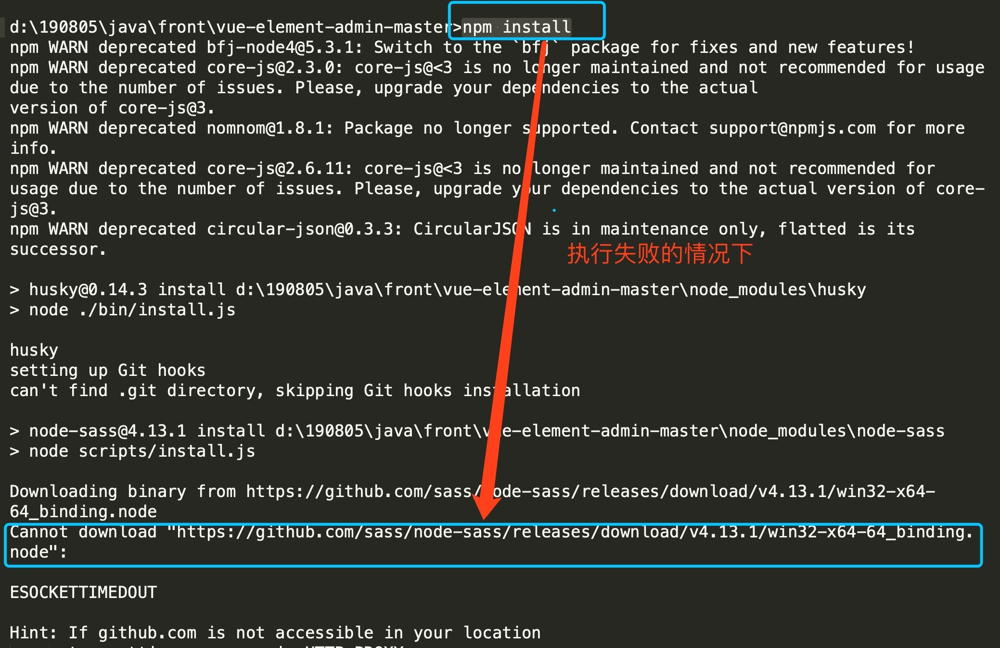

# PUP_CRM_2020 开发笔记

> 偶然在 B 站上看到了 Helen 老师主讲的谷粒在线教育项目课程，惊喜地发现前端居然也用了 vue-element-admin 框架。决定跟随视频敲一遍代码，同步实现 PUP CRM 2020 项目。该课程总计 22 天。涉及内容广泛，除 PUP CRM 2020 所必需的内容外，其他部分仅完成课程代码。
>
> 课程第一天说了一些项目相关的业务背景、技术应用基础知识，重点介绍了 MybatisPlus 框架。建立项目从第 2 天开始。本文的 Day XX 与视频的进程同步。

## Day 02 － 后端项目创建（2020-9-7）

### 一、项目环境搭建

#### （一）工程结构（TODO）

> 参考视频项目，将 PUP CRM 2020 项目结构搭建好。先这么抄过来，总体架构是这样，随着项目推进，逐步修改。
>
> 蓝色的表示已经建立的。
>
> 2020-09-16 经过对字典分类和字典的接口实现，发现实际上本项目没必要采用视频中的微服务方式，业务总体比较集中和简单，访问量也比较少，几乎没有高并发可能，未来部署也不可能有多台机器，所以，后续的各个接口服务都使用 sys 这个入口，尝试将 Mybatis Plus 生成的程序

- <span style="color:blue">**crm：根目录（父工程），管理 ?? 个子模块：**</span>

- - **canal_client****：canal数据库表同步模块（统计同步数据）**

  - <span style="color:blue">**common ：公共模块父节点**</span>

  - - <span style="color:blue">**common_util：工具类模块，所有模块都可以依赖于它**</span>
    - <span style="color:blue">**service_base：service 服务的 base 包，包含 service 服务的公共配置类，所有 service 模块依赖于它**</span>
    - spring_security：认证与授权模块，需要认证授权的service服务依赖于它

  - **infrastructure****：基础服务模块父节点**

  - - api_gateway：api网关服务

  - <span style="color:blue">**service：api 接口服务父节点**</span>

  - - <span style="color:blue">**service_sys：系统管理 api 接口服务（字典，字典分类，行政区划，高校，产品，丛书，经销商等基础数据）**</span>
    - service_academy：二级院校管理 api 接口服务
    - service_teacher：教师管理 api 接口服务
    - service_apply：样书管理 api 接口服务
    - service_activity：活动管理 api 接口服务
    - service_flow：教材流向管理 api 接口服务
    - service_report：阿里云oss api 接口服务
    - service_acl：用户权限管理 api 接口服务（用户管理、角色管理和权限管理等）
    - service_statistics：统计报表api接口服务
    - service_cms：cms api接口服务
    - service_sms：短信api接口服务
    - service_trade：订单和支付相关api接口服务
    - service_ucenter：会员api接口服务
    - service_vod：视频点播api接口服务

#### （二）创建父工程 crm

##### 1、创建 Spring Boot 项目

使用 Spring Initializr 快速初始化一个 Spring Boot 项目，其中，JDK 选择 8。

**Group**：cn.pup

**Artifact**：crm

##### 2、删除 src 目录

这个项目是用来做依赖管理的，而且只管理版本号，以便子模块可以按需加载依赖并统一版本，所以可以删除 crm 下的 src 文件夹。

##### 3、配置 SpringBoot 版本

考虑到版本的兼容性，计划所有依赖的版本都严格按照视频项目。其中 Spring Boot 的版本选择为 **2.2.1.RELEASE**。这个需要先用 Spring Initializr 创建后，到 POM 文件中修改。

##### 4、配置 pom 依赖版本号

删除所有的 dependencies 和 properties ，将下面的版本参数加入到 POM 文件中。

```xml
<properties>
    <java.version>1.8</java.version>
    <mybatis-plus.version>3.3.1</mybatis-plus.version>
    <velocity.version>2.0</velocity.version>
    <swagger.version>2.7.0</swagger.version>
    <aliyun.oss.version>3.1.0</aliyun.oss.version>
    <jodatime.version>2.10.1</jodatime.version>
    <commons-fileupload.version>1.3.1</commons-fileupload.version>
    <commons-io.version>2.6</commons-io.version>
    <commons-lang.version>3.9</commons-lang.version>
    <httpclient.version>4.5.1</httpclient.version>
    <jwt.version>0.7.0</jwt.version>
    <aliyun-java-sdk-core.version>4.3.3</aliyun-java-sdk-core.version>
    <aliyun-java-sdk-vod.version>2.15.2</aliyun-java-sdk-vod.version>
    <aliyun-sdk-vod-upload.version>1.4.11</aliyun-sdk-vod-upload.version>
    <fastjson.version>1.2.28</fastjson.version>
    <gson.version>2.8.2</gson.version>
    <json.version>20170516</json.version>
    <commons-dbutils.version>1.7</commons-dbutils.version>
    <canal.client.version>1.1.0</canal.client.version>
    <docker.image.prefix>zx</docker.image.prefix>
    <alibaba.easyexcel.version>2.1.1</alibaba.easyexcel.version>
    <apache.xmlbeans.version>3.1.0</apache.xmlbeans.version>
</properties>
```

##### 5、配置 pom 依赖

使用 dependencyManagement 标签加上所需要的依赖，这里只是管理了版本，依赖并未被实际引入。

**其中，注释掉的 aliyun-sdk-vod-upload 是不开源项目，后面做特殊处理。**

> 这里发现个小问题，就是本地没有引入的版本时会显示为红色，这是因为标签里面的依赖只是管理版本，并未真正安装。在 GuLi 项目中去掉 dependencyManagement 标签后，会真正安装依赖（下载到本地），可以看见 crm 项目中的 POM 就没又红色了，再把 GuLi 的标签复原。

```xml
<dependencyManagement>
    <dependencies>
        <!--Spring Cloud-->
        <dependency>
            <groupId>org.springframework.cloud</groupId>
            <artifactId>spring-cloud-dependencies</artifactId>
            <version>Hoxton.SR1</version>
            <type>pom</type>
            <scope>import</scope>
        </dependency>

        <dependency>
            <groupId>com.alibaba.cloud</groupId>
            <artifactId>spring-cloud-alibaba-dependencies</artifactId>
            <version>2.1.0.RELEASE</version>
            <type>pom</type>
            <scope>import</scope>
        </dependency>

        <!--mybatis-plus 持久层-->
        <dependency>
            <groupId>com.baomidou</groupId>
            <artifactId>mybatis-plus-boot-starter</artifactId>
            <version>${mybatis-plus.version}</version>
        </dependency>
        <dependency>
            <groupId>com.baomidou</groupId>
            <artifactId>mybatis-plus-generator</artifactId>
            <version>${mybatis-plus.version}</version>
        </dependency>

        <!-- velocity 模板引擎, Mybatis Plus 代码生成器需要 -->
        <dependency>
            <groupId>org.apache.velocity</groupId>
            <artifactId>velocity-engine-core</artifactId>
            <version>${velocity.version}</version>
        </dependency>

        <!--swagger-->
        <dependency>
            <groupId>io.springfox</groupId>
            <artifactId>springfox-swagger2</artifactId>
            <version>${swagger.version}</version>
        </dependency>
        <!--swagger ui-->
        <dependency>
            <groupId>io.springfox</groupId>
            <artifactId>springfox-swagger-ui</artifactId>
            <version>${swagger.version}</version>
        </dependency>

        <!--aliyunOSS-->
        <dependency>
            <groupId>com.aliyun.oss</groupId>
            <artifactId>aliyun-sdk-oss</artifactId>
            <version>${aliyun.oss.version}</version>
        </dependency>

        <!--日期时间工具-->
        <dependency>
            <groupId>joda-time</groupId>
            <artifactId>joda-time</artifactId>
            <version>${jodatime.version}</version>
        </dependency>

        <!--文件上传-->
        <dependency>
            <groupId>commons-fileupload</groupId>
            <artifactId>commons-fileupload</artifactId>
            <version>${commons-fileupload.version}</version>
        </dependency>

        <!--commons-io-->
        <dependency>
            <groupId>commons-io</groupId>
            <artifactId>commons-io</artifactId>
            <version>${commons-io.version}</version>
        </dependency>

        <!--commons-lang3-->
        <dependency>
            <groupId>org.apache.commons</groupId>
            <artifactId>commons-lang3</artifactId>
            <version>${commons-lang.version}</version>
        </dependency>

        <!--httpclient-->
        <dependency>
            <groupId>org.apache.httpcomponents</groupId>
            <artifactId>httpclient</artifactId>
            <version>${httpclient.version}</version>
        </dependency>

        <!-- JWT -->
        <dependency>
            <groupId>io.jsonwebtoken</groupId>
            <artifactId>jjwt</artifactId>
            <version>${jwt.version}</version>
        </dependency>

        <!--aliyun-->
        <dependency>
            <groupId>com.aliyun</groupId>
            <artifactId>aliyun-java-sdk-core</artifactId>
            <version>${aliyun-java-sdk-core.version}</version>
        </dependency>
        <dependency>
            <groupId>com.aliyun</groupId>
            <artifactId>aliyun-java-sdk-vod</artifactId>
            <version>${aliyun-java-sdk-vod.version}</version>
        </dependency>
        <!--<dependency>-->
        <!--<groupId>com.aliyun</groupId>-->
        <!--<artifactId>aliyun-sdk-vod-upload</artifactId>-->
        <!--<version>${aliyun-sdk-vod-upload.version}</version>-->
        <!--</dependency>-->

        <!--json-->
        <dependency>
            <groupId>com.alibaba</groupId>
            <artifactId>fastjson</artifactId>
            <version>${fastjson.version}</version>
        </dependency>
        <dependency>
            <groupId>org.json</groupId>
            <artifactId>json</artifactId>
            <version>${json.version}</version>
        </dependency>
        <dependency>
            <groupId>com.google.code.gson</groupId>
            <artifactId>gson</artifactId>
            <version>${gson.version}</version>
        </dependency>

        <dependency>
            <groupId>commons-dbutils</groupId>
            <artifactId>commons-dbutils</artifactId>
            <version>${commons-dbutils.version}</version>
        </dependency>

        <dependency>
            <groupId>com.alibaba.otter</groupId>
            <artifactId>canal.client</artifactId>
            <version>${canal.client.version}</version>
        </dependency>

        <dependency>
            <groupId>com.alibaba</groupId>
            <artifactId>easyexcel</artifactId>
            <version>${alibaba.easyexcel.version}</version>
        </dependency>

        <dependency>
            <groupId>org.apache.xmlbeans</groupId>
            <artifactId>xmlbeans</artifactId>
            <version>${apache.xmlbeans.version}</version>
        </dependency>

    </dependencies>
</dependencyManagement>
```

#### （三）创建父模块 common

##### 1、创建模块

在 crm 下创建普通 maven 模块

**Group：**cn.pup

**Artifact：**common

##### 2、删除src目录

##### 3、配置pom

 这次可没有 dependencyManagement 标签了，依赖真实导入到 External Libraries 中。

```xml
<dependencies>
    <dependency>
        <groupId>org.springframework.boot</groupId>
        <artifactId>spring-boot-starter-web</artifactId>
    </dependency>

    <!--mybatis-plus-->
    <dependency>
        <groupId>com.baomidou</groupId>
        <artifactId>mybatis-plus-boot-starter</artifactId>
    </dependency>

    <!--lombok用来简化实体类：需要安装lombok插件-->
    <dependency>
        <groupId>org.projectlombok</groupId>
        <artifactId>lombok</artifactId>
    </dependency>

    <!--swagger-->
    <dependency>
        <groupId>io.springfox</groupId>
        <artifactId>springfox-swagger2</artifactId>
    </dependency>
    <dependency>
        <groupId>io.springfox</groupId>
        <artifactId>springfox-swagger-ui</artifactId>
    </dependency>

</dependencies>
```

#### （四）创建模块 common_util

在common下创建普通 maven 模块

**Group：**cn.pup

**Artifact：**common_util

**注意：项目路径** 

#### （五）创建模块service_base

##### 1、创建模块

在common下创建普通 maven 模块

**Group：**cn.pup

**Artifact：**service_base

**注意：项目路径**

##### 2、配置pom

现在 service_base 模块依赖于 common_util 了。

```xml
 <dependencies>
     <dependency>
         <groupId>cn.pup</groupId>
         <artifactId>common_util</artifactId>
         <version>0.0.1-SNAPSHOT</version>
     </dependency>
</dependencies>
```

#### （六）创建父模块 service

##### 1、创建模块

在 crm 下创建普通 maven 模块

**Group：**cn.pup

**Artifact：**service

##### 2、删除src目录

##### 3、配置pom

```xml
<dependencies>
    <dependency>
        <groupId>cn.pup</groupId>
        <artifactId>service_base</artifactId>
        <version>0.0.1-SNAPSHOT</version>
    </dependency>

    <dependency>
        <groupId>org.springframework.boot</groupId>
        <artifactId>spring-boot-starter-web</artifactId>
    </dependency>

    <!--mybatis-plus-->
    <dependency>
        <groupId>com.baomidou</groupId>
        <artifactId>mybatis-plus-boot-starter</artifactId>
    </dependency>
    <dependency>
        <groupId>com.baomidou</groupId>
        <artifactId>mybatis-plus-generator</artifactId>
    </dependency>

    <!--mysql-->
    <dependency>
        <groupId>mysql</groupId>
        <artifactId>mysql-connector-java</artifactId>
    </dependency>

    <!-- velocity 模板引擎, Mybatis Plus 代码生成器需要 -->
    <dependency>
        <groupId>org.apache.velocity</groupId>
        <artifactId>velocity-engine-core</artifactId>
    </dependency>

    <!--swagger-->
    <dependency>
        <groupId>io.springfox</groupId>
        <artifactId>springfox-swagger2</artifactId>
    </dependency>
    <dependency>
        <groupId>io.springfox</groupId>
        <artifactId>springfox-swagger-ui</artifactId>
    </dependency>
    
    <!--日期时间工具-->
    <dependency>
        <groupId>joda-time</groupId>
        <artifactId>joda-time</artifactId>
    </dependency>

    <!--lombok用来简化实体类：需要安装lombok插件-->
    <dependency>
        <groupId>org.projectlombok</groupId>
        <artifactId>lombok</artifactId>
    </dependency>

    <dependency>
        <groupId>commons-fileupload</groupId>
        <artifactId>commons-fileupload</artifactId>
    </dependency>

    <!--httpclient-->
    <dependency>
        <groupId>org.apache.httpcomponents</groupId>
        <artifactId>httpclient</artifactId>
    </dependency>
    <!--commons-io-->
    <dependency>
        <groupId>commons-io</groupId>
        <artifactId>commons-io</artifactId>
    </dependency>

    <!--json-->
    <dependency>
        <groupId>com.alibaba</groupId>
        <artifactId>fastjson</artifactId>
    </dependency>
    <dependency>
        <groupId>org.json</groupId>
        <artifactId>json</artifactId>
    </dependency>
    <dependency>
        <groupId>com.google.code.gson</groupId>
        <artifactId>gson</artifactId>
    </dependency>

    <dependency>
        <groupId>org.springframework.boot</groupId>
        <artifactId>spring-boot-starter-test</artifactId>
        <scope>test</scope>
        <exclusions>
            <exclusion>
                <groupId>org.junit.vintage</groupId>
                <artifactId>junit-vintage-engine</artifactId>
            </exclusion>
        </exclusions>
    </dependency>
</dependencies>
```

#### （七）创建模块 service_sys

在 service 下创建普通 maven 模块

**Group：**cn.pup

**Artifact：**service_sys

**注意：项目路径**

> 这个模块就是一个可以独立运行的 Spring Boot 项目了

到此为止，项目的基本结构创建完成！

### 二、创建系统管理微服务

#### （一）数据库设计（TODO）

##### 1、数据库

创建数据库：pup_crm_2020

##### **2、数据表**

- 系统管理模块

- [x] 字典分类表：sys_dictionary_category
- [ ] 字典表
- [ ] ……

- 信息管理模块

- [ ] 二级院校表
- [ ] 教师表
- [ ] 教材流向表

- 样书管理模块

- [ ] 样书表
- [ ] 样书明细表

- 活动管理模块

- [ ] 巡展表
- [ ] 巡展院校表
- [ ] 会议表
- [ ] 会议通讯录表

- 业务管理模块

- [ ] 日报表
- [ ] 周报表

- 查询统计模块

- [ ] ……各种视图？

- 权限管理模块

- [ ] 用户表
- [ ] 角色表
- [ ] 权限表
- [ ] ……


#### （二）数据库设计规约

> **注意：**数据库设计规约并不是数据库设计的严格规范，根据不同团队的不同要求设计。

本项目参考《阿里巴巴Java开发手册》：五、MySQL数据库

1、库名与应用名称尽量一致

2、表名、字段名必须使用小写字母或数字，禁止出现数字开头，

3、表名不使用复数名词

4、表的命名最好是加上“业务名称_表的作用”。如，edu_teacher

5、表必备三字段：id, gmt_create, gmt_modified

6、单表行数超过 500 万行或者单表容量超过 2GB，才推荐进行分库分表。 说明：如果预计三年后的数据量根本达不到这个级别，请不要在创建表时就分库分表。 

7、表达是与否概念的字段，必须使用 is_xxx 的方式命名，数据类型是 unsigned tinyint （1 表示是，0 表示否）。 

说明：任何字段如果为非负数，必须是 unsigned。

注意：POJO 类中的任何布尔类型的变量，都不要加 is 前缀。数据库表示是与否的值，使用 tinyint 类型，坚持 is_xxx 的 命名方式是为了明确其取值含义与取值范围。 

正例：表达逻辑删除的字段名 is_deleted，1 表示删除，0 表示未删除。 

8、小数类型为 decimal，禁止使用 float 和 double。 说明：float 和 double 在存储的时候，存在精度损失的问题，很可能在值的比较时，得到不 正确的结果。如果存储的数据范围超过 decimal 的范围，建议将数据拆成整数和小数分开存储。

9、如果存储的字符串长度几乎相等，使用 char 定长字符串类型。 

10、varchar 是可变长字符串，不预先分配存储空间，长度不要超过 5000，如果存储长度大于此值，定义字段类型为 text，独立出来一张表，用主键来对应，避免影响其它字段索引效率。

11、唯一索引名为 uk_字段名(unique key)；普通索引名则为 idx_字段名(index)。

说明：uk_ 即 unique key；idx_ 即 index 的简称

12、不得使用外键与级联，一切外键概念必须在应用层解决。外键与级联更新适用于单机低并发，不适合分布式、高并发集群；级联更新是强阻塞，存在数据库更新风暴的风险；外键影响数据库的插入速度。 

> 还可以参照《58到家数据库30条军规》。作者：沈剑

#### （三）Mybatis Plus 代码生成器

> 视频中是先创建，逐步实践后优化，这里则先做准备，最后创建代码生成器，只需要运行一次（但是下次增加了表，还是得运行，回头研究一下，只针对一个表生成的办法）

##### 1、创建 BaseEntity （Super Class）

在 service_base 中创建 BaseEntity 类，里面包含了所有表都有的属性（id，gmtCreate，gmtModified）。

```java
package cn.pup.crm.service.base.model;

/**
 * Super Class
 * 为所有的实体类提供公共属性的父类
 * @author Howard.Ge
 * @since 2020-09-07
 */

@Data
@EqualsAndHashCode(callSuper = false)
@Accessors(chain = true)
public class BaseEntity implements Serializable {

    private static final long serialVersionUID=1L;

    @ApiModelProperty(value = "ID")
    @TableId(value = "id", type = IdType.ASSIGN_ID)
    private String id;

    @ApiModelProperty(value = "创建时间")
    @TableField(fill = FieldFill.INSERT)
    private Date gmtCreate;

    @ApiModelProperty(value = "更新时间")
    @TableField(fill = FieldFill.INSERT_UPDATE)
    private Date gmtModified;
}
```

**相关注解的说明**

- `@Data`

相当于@Getter @Setter @RequiredArgsConstructor @ToString @EqualsAndHashCode这5个注解的合集。

启用 lombok，可以只写属性，其他的 setter 和 getter 等方法都自动生成。

- `@EqualsAndHashCode(callSuper = false)`

1. 此注解会生成equals(Object other) 和 hashCode()方法。
2. 它默认使用非静态，非瞬态的属性
3. 可通过参数exclude排除一些属性
4. 可通过参数of指定仅使用哪些属性
5. 它默认仅使用该类中定义的属性且不调用父类的方法
6. 可通过callSuper=true解决上一点问题。让其生成的方法中调用父类的方法。

- `@Accessors(chain = true)`

1. 使用fluent属性，getter和setter方法的方法名都是属性名，且setter方法返回当前对象
2. 使用chain属性，setter方法返回当前对象
3. 使用prefix属性，getter和setter方法会忽视属性名的指定前缀（遵守驼峰命名） 

##### 2、创建代码生成器

在 service_sys 的 test 目录中创建代码生成器 CodeGenerator 类。放在 test 文件夹可以在构建项目时排除掉。

```Java
package cn.pup.crm.service.sys;

/**
 * 代码生成器
 * @author Howard.Ge
 * @since 2020-09-07
 */

public class CodeGenerator {

    @Test
    public void genCode() {

        String prefix = "";	// 数据库前缀  检查是否需要修改
        String moduleName = "sys";	// 模块名称  检查是否需要修改

        // 1、创建代码生成器
        AutoGenerator mpg = new AutoGenerator();

        // 2、全局配置
        GlobalConfig gc = new GlobalConfig();
        String projectPath = System.getProperty("user.dir");
        gc.setOutputDir(projectPath + "/src/main/java");
        gc.setAuthor("Howard.Ge");
        gc.setOpen(false);	 //生成后是否打开资源管理器
        gc.setFileOverride(false);	 //重新生成时文件是否覆盖
        gc.setServiceName("%sService");	 //去掉Service接口的首字母I
        gc.setIdType(IdType.ASSIGN_ID);	 //主键策略
        gc.setDateType(DateType.ONLY_DATE);	//定义生成的实体类中日期类型
        gc.setSwagger2(true);	//开启Swagger2模式
        mpg.setGlobalConfig(gc);

        // 3、数据源配置
        DataSourceConfig dsc = new DataSourceConfig();
        dsc.setUrl("jdbc:mysql://localhost:3306/pup_crm_2020?serverTimezone=GMT%2B8");  //检查是否需要修改
        dsc.setDriverName("com.mysql.cj.jdbc.Driver");
        dsc.setUsername("root");    
        dsc.setPassword("Dashu123");    //检查是否需要修改
        dsc.setDbType(DbType.MYSQL);
        mpg.setDataSource(dsc);

        // 4、包配置
        PackageConfig pc = new PackageConfig();
        pc.setModuleName(moduleName); 	//模块名   检查是否需要修改
        pc.setParent("cn.pup.crm.service"); // 父包名  检查是否需要修改
        pc.setController("controller");
        pc.setEntity("entity");
        pc.setService("service");
        pc.setMapper("mapper");
        mpg.setPackageInfo(pc);

        // 5、策略配置
        StrategyConfig strategy = new StrategyConfig();
        strategy.setNaming(NamingStrategy.underline_to_camel);	//数据库表映射到实体的命名策略
        strategy.setTablePrefix(moduleName + "_");	//设置表前缀不生成

        strategy.setColumnNaming(NamingStrategy.underline_to_camel);	//数据库表字段映射到实体的命名策略
        strategy.setEntityLombokModel(true);	 // lombok 模型 @Accessors(chain = true) setter链式操作

        strategy.setLogicDeleteFieldName("is_deleted");	//逻辑删除字段名
        strategy.setEntityBooleanColumnRemoveIsPrefix(true);	//去掉布尔值的is_前缀

        //自动填充
        TableFill gmtCreate = new TableFill("gmt_create", FieldFill.INSERT);
        TableFill gmtModified = new TableFill("gmt_modified", FieldFill.INSERT_UPDATE);
        ArrayList<TableFill> tableFills = new ArrayList<>();
        tableFills.add(gmtCreate);
        tableFills.add(gmtModified);
        strategy.setTableFillList(tableFills);

        strategy.setRestControllerStyle(true); 	//restful api风格控制器
        strategy.setControllerMappingHyphenStyle(true); 	//url中驼峰转连字符
        mpg.setStrategy(strategy);

        //设置BaseEntity
        strategy.setSuperEntityClass("cn.pup.crm.service.base.model.BaseEntity");   //提供公共属性的父类，检查是否需要修改
        // 填写BaseEntity中的公共字段
        strategy.setSuperEntityColumns("id", "gmt_create", "gmt_modified"); //公共属性，检查是否需要修改

        // 6、执行
        mpg.execute();
    }
}

```

##### **3、执行代码生成器**

所有实体类都继承了BaseEntity，XxxServiceImpl 继承了 ServiceImpl 类，并且 Mybatis Plus 为我们在 ServiceImpl 中注入了 baseMapper。其他的参照生成器中的策略检查是否正确。

##### 4、修改 entity 包中的（部分）实体

引入缺少的 @TableField 的包。

> 到目前为止，项目只针对 sys_dictionary_category 一张表进行了生成，计划 Day 02 全部完成后，将系统管理的相关表的 api 接口补充完整。

#### （四）启动应用程序

##### 1、创建 application.yml 文件

在 service_sys 中的 src\main\resources 下创建 application.yml。

```yaml
server:
  port: 8010 # 服务端口

spring:
  profiles:
    active: dev # 环境设置
  application:
    name: service-edu # 服务名
  datasource: # mysql数据库连接，注意修改数据库名和密码
    driver-class-name: com.mysql.cj.jdbc.Driver
    url: jdbc:mysql://localhost:3306/pup_crm_2020?serverTimezone=GMT%2B8&useUnicode=true&characterEncoding=UTF-8&useSSL=false	
    username: root
    password: Dashu123	

#mybatis日志
mybatis-plus:
  configuration:
    log-impl: org.apache.ibatis.logging.stdout.StdOutImpl
```

##### 2、创建 SpringBoot 配置文件

在 service_base 中创建  cn.pup.crm.service.base.config 包并在其中创建 MybatisPlusConfig 类。

```java
package cn.pup.crm.service.base.config;

@EnableTransactionManagement
@Configuration
@MapperScan("cn.pup.crm.service.*.mapper")	// 扫描包，* 就可以包括所有未来新的微服务的 mapper
public class MybatisPlusConfig {

    /**
     * 分页插件
     */
    @Bean
    public PaginationInterceptor paginationInterceptor() {
        return new PaginationInterceptor();
    }
}
```

##### 3、创建 SpringBoot 启动类

在 cn.pup.crm.service.sys 中创建启动类 ServiceSysApplication，扫描 cn.pup.crm

```java
package cn.pup.crm.service.sys;

@SpringBootApplication
@ComponentScan({"cn.pup.crm"})
public class ServiceSysApplication {
    
    public static void main(String[] args) {
        SpringApplication.run(ServiceSysApplication.class, args);
    }
}
```

##### 4、运行启动类

查看控制台 8110 端口是否成功启动

#### （五）字典分类列表 API

##### 1、编写字典分类管理接口

因为这个管理接口是面向后端管理员而非前端用户的，所以在 cn.pup.crm.service.edu.controller 包中创建 admin 包，专门供后台管理使用。然后将字典管理的 Controller 移到 admin 包中。

修改 DictionaryCategoryController 的 @RequestMapping 注解中的路径，在前面添加 "/admin"。

```java
package cn.pup.crm.service.sys.controller.admin;

@RestController
@RequestMapping("/admin/sys/dictionary-category")
public class DictionaryCategoryController {
    @Autowired
        private DictionaryCategoryService dictionaryCategoryService;

        @GetMapping("list")
        public List<DictionaryCategory> listAll() {
            return dictionaryCategoryService.list();
        }
}

```

##### 2、统一返回的json时间格式

默认情况下json时间格式带有时区，并且是世界标准时间，和我们的时间差了八个小时

在application.yml中设置

```yaml
#spring:
  jackson: #返回json的全局时间格式
    date-format: yyyy-MM-dd HH:mm:ss
    time-zone: GMT+8
```

所有实体类中的所有的 Date 属性添加数据类型转换，可以覆盖全局配置（包括 BaseEntity 类）

```java
@JsonFormat(timezone = "GMT+8", pattern = "yyyy-MM-dd")
```

##### 3、重启程序

访问：http://localhost:8010/admin/sys/dictionary-category/list 查看结果 json 数据，可以看到显示格式和时区都正常了。

> 字典分类还需要有其他的 API，改变一下视频笔记的顺序，先弄 Swagger，然后建立 API 并使用 Swagger 进行测试。

#### （六）配置 Swagger

Swagger 是一个规范和完整的框架，用于生成、描述、调用和可视化 RESTful 风格的 Web 服务。官网：https://swagger.io/

前后端分离开发模式中，api文档是最好的沟通方式，具有以下优势。

- **及时性** (接口变更后，能够及时准确地通知相关前后端开发人员)
- **规范性** (并且保证接口的规范性，如接口的地址，请求方式，参数及响应格式和错误信息)
- **一致性** (接口信息一致，不会出现因开发人员拿到的文档版本不一致，而出现分歧)
- **可测性** (直接在接口文档上进行测试，以方便理解业务)

前后端分离开发的一般步骤如下：

- 前端工程师编写接口文档（使用swagger2编辑器或其他接口生成工具）
- 交给后端工程师
- 根据swagger文档编写后端接口
- 最终根据生成的swagger文件进行接口联调

##### 1. 添加依赖

在 common 中添加依赖。

```xml
<!--swagger-->
<dependency>
    <groupId>io.springfox</groupId>
    <artifactId>springfox-swagger2</artifactId>
</dependency>
<dependency>
    <groupId>io.springfox</groupId>
    <artifactId>springfox-swagger-ui</artifactId>
</dependency>
```

##### 2. 创建 Swagger 配置类

在 service_base 中创建 Swagger2Config 类。

```java
package cn.pup.crm.service.base.config;

@Configuration
@EnableSwagger2
public class Swagger2Config {

    @Bean
    public Docket webApiConfig(){
        return new Docket(DocumentationType.SWAGGER_2)
                .groupName("webApi")
                .apiInfo(webApiInfo())
                .select()
                //只显示api路径下的页面
                .paths(Predicates.and(PathSelectors.regex("/api/.*")))
                .build();
    }

    @Bean
    public Docket adminApiConfig(){
        return new Docket(DocumentationType.SWAGGER_2)
                .groupName("adminApi")
                .apiInfo(adminApiInfo())
                .select()
                //只显示admin路径下的页面
                .paths(Predicates.and(PathSelectors.regex("/admin/.*")))
                .build();
    }

    private ApiInfo webApiInfo(){
        return new ApiInfoBuilder()
                .title("网站-API文档")
                .description("本文档描述了网站微服务接口定义")
                .version("1.0")
                .contact(new Contact("Howard.Ge", "http://pup.cn", "ghh@pup.cn"))
                .build();
    }

    private ApiInfo adminApiInfo(){
        return new ApiInfoBuilder()
                .title("后台管理系统-API文档")
                .description("本文档描述了后台管理系统微服务接口定义")
                .version("1.0")
                .contact(new Contact("Howard.Ge", "http://pup.cn", "ghh@pup.cn"))
                .build();
    }
}
```

##### 3. 重启服务查看接口

http://localhost:8010/swagger-ui.html

##### 3. 常见注解

###### （1）API 模型

entity的实体类中可以添加一些自定义设置，例如：

定义样例数据

```java
@ApiModelProperty(value = "创建时间", example = "2019-01-01 8:00:00")
@TableField(fill = FieldFill.INSERT)
private Date gmtCreate;

@ApiModelProperty(value = "更新时间", example = "2010-01-01")
@TableField(fill = FieldFill.INSERT_UPDATE)
private Date gmtModified;
```

###### （2）定义接口说明和参数说明

- 定义在类上：@Api
- 定义在方法上：@ApiOperation
- 定义在参数上：@ApiParam

```java
package cn.pup.crm.service.sys.controller.admin;

@Api(description = "字典分类管理")
@RestController
@RequestMapping("/admin/sys/dictionary-category")
public class DictionaryCategoryController {

    @Autowired
    private DictionaryCategoryService dictionaryCategoryService;

    @ApiOperation("所有字典分类列表")
    @GetMapping("list")
    public List<DictionaryCategory> listAll() {
        return dictionaryCategoryService.list();
    }

    @ApiOperation(value = "根据 ID 删除字典分类", notes = "逻辑删除")
    @DeleteMapping("remove/{id}")
    public boolean removeById(@ApiParam(value = "字典分类ID", required = true) @PathVariable String id) {
        return dictionaryCategoryService.removeById(id);
    }

}
```


#### （七）逻辑删除 API

##### 1、添加删除方法

在 TeacherController 添加 removeById 方法

```java
@DeleteMapping("remove/{id}")
public boolean removeById(@PathVariable String id){
    return teacherService.removeById(id);
}
```

##### 2、在 Swagger 页面中测试删除

### 三、非业务功能统一处理

####（一）统一返回数据格式

项目中我们会将响应封装成json返回，一般我们会将所有接口的数据格式统一， 使前端(iOS Android, Web)对数据的操作更加一致、轻松。

统一返回数据格式没有固定的格式，只要能描述清楚返回的数据状态以及要返回的具体数据就可以。一般情况下，会包含状态码、返回消息、数据这几部分内容。例如，我们的系统要求返回的基本数据格式如下：

##### 1. 列表

```json
{
  "success": true,
  "code": 20000,
  "message": "成功",
  "data": {
    "items": [
      {
        "id": "1",
        "name": "刘德华",
        "intro": "毕业于师范大学数学系，热爱教育事业，执教数学思维6年有余"
      }
    ]
  }
}
```

##### 2. 分页

```json
{
  "success": true,
  "code": 20000,
  "message": "成功",
  "data": {
    "total": 17,
    "rows": [
      {
        "id": "1",
        "name": "刘德华",
        "intro": "毕业于师范大学数学系，热爱教育事业，执教数学思维6年有余"
      }
    ]
  }
}
```

##### 3. 没有返回数据 

```json
{
  "success": true,
  "code": 20000,
  "message": "成功",
  "data": {}
}
```

##### 4. 失败 

```json
{
  "success": false,
  "code": 20001,
  "message": "失败",
  "data": {}
}
```
因此，我们定义统一结果


```json
{
  "success": "布尔", // 响应是否成功
  "code": "数字", // 响应码
  "message": "字符串", // 返回消息
  "data": "HashMap" // 返回数据，放在键值对中
}
```


#### （二）定义统一返回结果

##### 1、创建返回码定义枚举类

在 common_util 中创建包：cn.pup.crm.common.base.result，并在其中创建两个类：

- 枚举类（定义返回码）： ResultCodeEnum.java

（代码后补）

- 结果类：R.java

```java
package cn.pup.crm.common.base.result;

@Data
@ApiModel(value = "全局统一返回结果")
public class R {

    @ApiModelProperty(value = "是否成功")
    private Boolean success;

    @ApiModelProperty(value = "返回码")
    private Integer code;

    @ApiModelProperty(value = "返回消息")
    private String message;

    @ApiModelProperty(value = "返回数据")
    private Map<String, Object> data = new HashMap<String, Object>();

    public R(){}

    public static R ok(){
        R r = new R();
        r.setSuccess(ResultCodeEnum.SUCCESS.getSuccess());
        r.setCode(ResultCodeEnum.SUCCESS.getCode());
        r.setMessage(ResultCodeEnum.SUCCESS.getMessage());
        return r;
    }

    public static R error(){
        R r = new R();
        r.setSuccess(ResultCodeEnum.UNKNOWN_REASON.getSuccess());
        r.setCode(ResultCodeEnum.UNKNOWN_REASON.getCode());
        r.setMessage(ResultCodeEnum.UNKNOWN_REASON.getMessage());
        return r;
    }

    public static R setResult(ResultCodeEnum resultCodeEnum){
        R r = new R();
        r.setSuccess(resultCodeEnum.getSuccess());
        r.setCode(resultCodeEnum.getCode());
        r.setMessage(resultCodeEnum.getMessage());
        return r;
    }

    public R success(Boolean success){
        this.setSuccess(success);
        return this;
    }

    public R message(String message){
        this.setMessage(message);
        return this;
    }

    public R code(Integer code){
        this.setCode(code);
        return this;
    }

    public R data(String key, Object value){
        this.data.put(key, value);
        return this;
    }

    public R data(Map<String, Object> map){
        this.setData(map);
        return this;
    }
}

```

##### 2、修改 Controller 中的返回结果

修改 service_sys 中的 DictionaryCategoryController 的接口方法

```java
@ApiOperation("所有字典分类列表")
    @GetMapping("list")
    public R listAll() {
        List<DictionaryCategory> list = dictionaryCategoryService.list();
        return R.ok().data("items", list).message("获取字典分类列表成功。");
    }

    @ApiOperation(value = "根据 ID 删除字典分类", notes = "逻辑删除")
    @DeleteMapping("remove/{id}")
    public R removeById(@ApiParam(value = "字典分类ID", required = true) @PathVariable String id) {
        boolean result = dictionaryCategoryService.removeById(id);
        return result ? R.ok().message("删除成功") : R.ok().message("数据不存在");
    }
```

##### 3、重启测试

#### （三）分页

##### 1、分页 Controller 方法

在 DictionaryCategoryController 中添加分页方法 

```java
    @ApiOperation("分页字典分类列表")
    @GetMapping("list/{page}/{limit}")
    public R listPage(@ApiParam(value = "当前页码", required = true) @PathVariable Long page,
                      @ApiParam(value = "每页记录数", required = true) @PathVariable Long limit){

        Page<DictionaryCategory> pageParam = new Page<>(page, limit);
        IPage<DictionaryCategory> pageModel = dictionaryCategoryService.page(pageParam);
        List<DictionaryCategory> records = pageModel.getRecords();
        long total = pageModel.getTotal();
        return  R.ok().data("total", total).data("rows", records);
    }
```

##### 2、Swagger 中测试

#### （四）条件查询

实际上就是每个实体类列表页的筛选表单包含的字段作为条件。采用查询对象的方式，便于前台数据包装。在 service_sys 中创建包 cn.pup.crm.service.sys.entity.vo，里面的查询类命名格式为 `实体名+QueryVo`

根据字典分类名称 name，字典分类代码 code、创建时间 gmtCreate、最后修改时间 gmtModified 查询。

##### 1、创建查询对象 

（DictionaryCategoryQueryVo）

```java
package cn.pup.crm.service.sys.entity.vo;

@Data
public class DictionaryCategoryQueryVo implements Serializable {
    private static final long serialVersionUID = 1L;

    private String name;
    private String code;
    private Date gmtCreate;
    private Date gmtModified;
}
```

##### 2、修改 service

接口 

```java
package cn.pup.crm.service.sys.service;

public interface DictionaryCategoryService extends IService<DictionaryCategory> {
    IPage<DictionaryCategory> selectPage(Long page, Long limit, DictionaryCategoryQueryVo dictionaryCategoryQueryVo);
}
```

实现 

```java
package cn.pup.crm.service.sys.service.impl;

/**
 * 字典分类 服务实现类
 *
 * @author Howard.Ge
 * @since 2020-09-07
 */
@Service
public class DictionaryCategoryServiceImpl extends ServiceImpl<DictionaryCategoryMapper, DictionaryCategory> implements DictionaryCategoryService {

    /**
     * 分页条件查询
     * @param page 当前页码
     * @param limit 每页记录数
     * @param dictionaryCategoryQueryVo 字典分类VO（属性为查询条件）
     * @return
     */
    @Override
    public IPage<DictionaryCategory> selectPage(Long page, Long limit, DictionaryCategoryQueryVo dictionaryCategoryQueryVo) {

        Page<DictionaryCategory> pageParam = new Page<>(page, limit);

        QueryWrapper<DictionaryCategory> queryWrapper = new QueryWrapper<>();
        queryWrapper.orderByAsc("sort");

        if (dictionaryCategoryQueryVo == null) {
            return baseMapper.selectPage(pageParam, queryWrapper);
        }

        String name = dictionaryCategoryQueryVo.getName();
        String code = dictionaryCategoryQueryVo.getCode();
        String gmtCreateBegin = dictionaryCategoryQueryVo.getGmtCreateBegin();
        String gmtCreateEnd = dictionaryCategoryQueryVo.getGmtCreateEnd();
        String gmtModifiedBegin = dictionaryCategoryQueryVo.getGmtModifiedBegin();
        String gmtModifiedEnd = dictionaryCategoryQueryVo.getGmtModifiedEnd();

        //如果查询的字段为数字，判断是否为空

        // 逐个条件注入
        if (!StringUtils.isEmpty(name)) {
            // 左%会使索引失效
            queryWrapper.like("name", name);
        }
        if (!StringUtils.isEmpty(code)) {
            queryWrapper.like("code", code);
        }
        if (!StringUtils.isEmpty(gmtCreateBegin)) {
            queryWrapper.ge("gmtCreate", gmtCreateBegin);
        }
        if (!StringUtils.isEmpty(gmtCreateEnd)) {
            queryWrapper.le("gmtCreate", gmtCreateEnd);
        }
        if (!StringUtils.isEmpty(gmtModifiedBegin)) {
            queryWrapper.ge("gmtModified", gmtModifiedBegin);
        }
        if (!StringUtils.isEmpty(gmtModifiedEnd)) {
            queryWrapper.le("gmtModified", gmtModifiedEnd);
        }
        return baseMapper.selectPage(pageParam, queryWrapper);

    }
}

```

##### 3、修改 controller

修改 DictionaryCategoryController 中的 listPage 方法：增加参数 DictionaryCategoryQueryVo dictionaryCategoryQueryVo，非必选

dictionaryCategoryService.page 修改成 dictionaryCategoryService.selectPage，并传递teacherQueryVo参数。

```java
    @ApiOperation("分页字典分类列表")
    @GetMapping("list/{page}/{limit}")
    public R listPage(@ApiParam(value = "当前页码", required = true) @PathVariable Long page,
                      @ApiParam(value = "每页记录数", required = true) @PathVariable Long limit,
                      @ApiParam(value = "字典分类查询对象") DictionaryCategoryQueryVo dictionaryCategoryQueryVo){

        IPage<DictionaryCategory> pageModel = dictionaryCategoryService.selectPage(page, limit, dictionaryCategoryQueryVo);
        List<DictionaryCategory> records = pageModel.getRecords();
        long total = pageModel.getTotal();

        return  R.ok().data("total", total).data("rows", records);
    }
```

##### 4、Swagger 中测试

发现只能查英文，不能查中文！需要依次检查下面几个地方：

- application.yml

```yaml
url: jdbc:mysql://localhost:3306/pup_crm_2020?serverTimezone=GMT%2B8&useUnicode=true&characterEncoding=UTF-8&useSSL=false
```

其中的 `useUnicode=true` 和 `characterEncoding=UTF-8` 不能少，注意大小写。

- 数据库属性

```sql
CREATE DATABASE pup_crm_2020
CHARACTER SET utf8mb4
COLLATE utf8mb4_general_ci;
```

- idea 的设置

在 settings 中搜索 encoding，统统改成 UTF-8。

#### （五）自动填充

在 service_base 中创建包：cn.pup.crm.service.base.handler 并在其中创建自动填充处理类：CommonMetaObjectHandler

```java
package cn.pup.crm.service.base.handler;

@Component
public class CommonMetaObjectHandler implements MetaObjectHandler {

    @Override
    public void insertFill(MetaObject metaObject) {
        this.setFieldValByName("gmtCreate", new Date(), metaObject);
        this.setFieldValByName("gmtModified", new Date(), metaObject);
    }

    @Override
    public void updateFill(MetaObject metaObject) {
        this.setFieldValByName("gmtModified", new Date(), metaObject);
    }
}
```

#### （六）定义新增和修改 API

在 service_sys 中新增 controller 方法。

##### 1、新增

新增的时候，id 如果不为空则直接赋值（有重复的会报错），id为空值 null 或者空字符串的时候才会自动生成。自动填充的时间字段不会受传入对象的影响，会依据规则自动填入。

```java
    @ApiOperation("新增字典分类")
    @PostMapping("save")
    public R save(@ApiParam(value = "字典分类对象", required = true) @RequestBody DictionaryCategory dictionaryCategory) {
        boolean result = dictionaryCategoryService.save(dictionaryCategory);
        return result ? R.ok().message("保存成功") : R.error().message("保存失败");
    }
```

##### 2、根据 id 修改

```java
    @ApiOperation("更新字典分类")
    @PutMapping("update")
    public R updateById(@ApiParam(value = "字典分类对象", required = true) @RequestBody DictionaryCategory dictionaryCategory) {
        boolean result = dictionaryCategoryService.updateById(dictionaryCategory);
        if (result) {
            return R.ok().message("修改成功");
        } else {
            return R.error().message("数据不存在");
        }
    }
```

##### 3、根据 id 获取字典分类信息 

```java
    @ApiOperation("根据id获取字典分类信息")
    @GetMapping("get/{id}")
    public R getById(@ApiParam(value = "字典分类ID", required = true) @PathVariable String id) {
        DictionaryCategory dictionaryCategory = dictionaryCategoryService.getById(id);
        if (dictionaryCategory != null) {
            return R.ok().data("item", dictionaryCategory);
        } else {
            return R.error().message("数据不存在");
        }
    }
```

#### （七）统一异常处理

我们想让异常结果也显示为统一的返回结果对象，并且统一处理系统的异常信息，那么需要统一异常处理

##### 1、创建统一异常处理器

在 service-base 中的 handler 包中，创建统一异常处理类：GlobalExceptionHandler.java： 

```java
package com.atguigu.guli.service.base.handler;

@ControllerAdvice
public class GlobalExceptionHandler {

    @ExceptionHandler(Exception.class)
    @ResponseBody
    public R error(Exception e){
        e.printStackTrace();
        return R.error();
    }
}
```

##### 2、添加异常处理方法

在 GlobalExceptionHandler.java 中添加下面的异常处理方法。

（1）处理 SQL 语法错误产生的 BadSqlGrammarException 异常。

```java
@ExceptionHandler(BadSqlGrammarException.class)
@ResponseBody
public R error(BadSqlGrammarException e){
    e.printStackTrace();
    return R.setResult(ResultCodeEnum.BAD_SQL_GRAMMAR);
}
```

（2）处理由于输入非法的 json 参数产生的 HttpMessageNotReadableException 异常

```java
@ExceptionHandler(HttpMessageNotReadableException.class)
@ResponseBody
public R error(HttpMessageNotReadableException e){
    e.printStackTrace();
    return R.setResult(ResultCodeEnum.JSON_PARSE_ERROR);
}
```

##### 3、自定义异常

TODO

#### （八）统一日志处理

##### 1、什么是日志

通过日志查看程序的运行过程，运行信息，异常信息等

##### 2、配置日志级别

日志记录器（Logger）的行为是分等级的。如下表所示：

分为：**FATAL**、**ERROR**、**WARN**、**INFO**、**DEBUG**

默认情况下，spring boot从控制台打印出来的日志级别只有INFO及以上级别，可以配置日志级别 

```
# 设置日志级别
logging:
  level:
    root: ERROR
```

这种方式能将ERROR级别以及以上级别的日志打印在控制台上

##### 3、Logback日志

spring boot 内部使用 Logback 作为日志实现的框架，Logback 和 log4j 非常相似。

logback相对于log4j的一些优点：https://blog.csdn.net/caisini_vc/article/details/48551287

###### （1）配置logback日志

**删除application.yml中的日志配置**

**安装idea彩色日志插件：grep console**

resources 中创建 logback-spring.xml （默认日志的名字，必须是这个名字） 

```xml
<?xml version="1.0" encoding="UTF-8"?>
<configuration  scan="true" scanPeriod="10 seconds">

    <contextName>logback</contextName>

    <property name="log.path" value="D:/Project2020/CRM2020_log/sys" />

    <!--控制台日志格式：彩色日志-->
    <!-- magenta:洋红 -->
    <!-- boldMagenta:粗红-->
    <!-- cyan:青色 -->
    <!-- white:白色 -->
    <!-- magenta:洋红 -->
    <property name="CONSOLE_LOG_PATTERN"
              value="%yellow(%date{yyyy-MM-dd HH:mm:ss}) |%highlight(%-5level) |%blue(%thread) |%blue(%file:%line) |%green(%logger) |%cyan(%msg%n)"/>

    <!--文件日志格式-->
    <property name="FILE_LOG_PATTERN"
              value="%date{yyyy-MM-dd HH:mm:ss} |%-5level |%thread |%file:%line |%logger |%msg%n" />

    <!--编码-->
    <property name="ENCODING"
              value="UTF-8" />

    <!--输出到控制台-->
    <appender name="CONSOLE" class="ch.qos.logback.core.ConsoleAppender">
        <filter class="ch.qos.logback.classic.filter.ThresholdFilter">
            <!--日志级别-->
            <level>DEBUG</level>
        </filter>
        <encoder>
            <!--日志格式-->
            <Pattern>${CONSOLE_LOG_PATTERN}</Pattern>
            <!--日志字符集-->
            <charset>${ENCODING}</charset>
        </encoder>
    </appender>

    <!--输出到文件-->
    <appender name="INFO_FILE" class="ch.qos.logback.core.rolling.RollingFileAppender">
        <!--日志过滤器：此日志文件只记录INFO级别的-->
        <filter class="ch.qos.logback.classic.filter.LevelFilter">
            <level>INFO</level>
            <onMatch>ACCEPT</onMatch>
            <onMismatch>DENY</onMismatch>
        </filter>
        <!-- 正在记录的日志文件的路径及文件名 -->
        <file>${log.path}/log_info.log</file>
        <encoder>
            <pattern>${FILE_LOG_PATTERN}</pattern>
            <charset>${ENCODING}</charset>
        </encoder>
        <!-- 日志记录器的滚动策略，按日期，按大小记录 -->
        <rollingPolicy class="ch.qos.logback.core.rolling.TimeBasedRollingPolicy">
            <!-- 每天日志归档路径以及格式 -->
            <fileNamePattern>${log.path}/info/log-info-%d{yyyy-MM-dd}.%i.log</fileNamePattern>
            <timeBasedFileNamingAndTriggeringPolicy class="ch.qos.logback.core.rolling.SizeAndTimeBasedFNATP">
                <maxFileSize>500MB</maxFileSize>
            </timeBasedFileNamingAndTriggeringPolicy>
            <!--日志文件保留天数-->
            <maxHistory>15</maxHistory>
        </rollingPolicy>
    </appender>

    <appender name="WARN_FILE" class="ch.qos.logback.core.rolling.RollingFileAppender">
        <!-- 日志过滤器：此日志文件只记录WARN级别的 -->
        <filter class="ch.qos.logback.classic.filter.LevelFilter">
            <level>WARN</level>
            <onMatch>ACCEPT</onMatch>
            <onMismatch>DENY</onMismatch>
        </filter>
        <!-- 正在记录的日志文件的路径及文件名 -->
        <file>${log.path}/log_warn.log</file>
        <encoder>
            <pattern>${FILE_LOG_PATTERN}</pattern>
            <charset>${ENCODING}</charset> <!-- 此处设置字符集 -->
        </encoder>
        <!-- 日志记录器的滚动策略，按日期，按大小记录 -->
        <rollingPolicy class="ch.qos.logback.core.rolling.TimeBasedRollingPolicy">
            <fileNamePattern>${log.path}/warn/log-warn-%d{yyyy-MM-dd}.%i.log</fileNamePattern>
            <timeBasedFileNamingAndTriggeringPolicy class="ch.qos.logback.core.rolling.SizeAndTimeBasedFNATP">
                <maxFileSize>100MB</maxFileSize>
            </timeBasedFileNamingAndTriggeringPolicy>
            <!--日志文件保留天数-->
            <maxHistory>15</maxHistory>
        </rollingPolicy>
    </appender>

    <appender name="ERROR_FILE" class="ch.qos.logback.core.rolling.RollingFileAppender">
        <!-- 日志过滤器：此日志文件只记录ERROR级别的 -->
        <filter class="ch.qos.logback.classic.filter.LevelFilter">
            <level>ERROR</level>
            <onMatch>ACCEPT</onMatch>
            <onMismatch>DENY</onMismatch>
        </filter>
        <!-- 正在记录的日志文件的路径及文件名 -->
        <file>${log.path}/log_error.log</file>
        <encoder>
            <pattern>${FILE_LOG_PATTERN}</pattern>
            <charset>${ENCODING}</charset> <!-- 此处设置字符集 -->
        </encoder>
        <!-- 日志记录器的滚动策略，按日期，按大小记录 -->
        <rollingPolicy class="ch.qos.logback.core.rolling.TimeBasedRollingPolicy">
            <fileNamePattern>${log.path}/error/log-error-%d{yyyy-MM-dd}.%i.log</fileNamePattern>
            <timeBasedFileNamingAndTriggeringPolicy class="ch.qos.logback.core.rolling.SizeAndTimeBasedFNATP">
                <maxFileSize>100MB</maxFileSize>
            </timeBasedFileNamingAndTriggeringPolicy>
            <!--日志文件保留天数-->
            <maxHistory>15</maxHistory>
        </rollingPolicy>
    </appender>

    <!--开发环境-->
    <springProfile name="dev">
        <!--可以灵活设置此处，从而控制日志的输出-->
        <root level="INFO">
            <appender-ref ref="CONSOLE" />
            <appender-ref ref="INFO_FILE" />
            <appender-ref ref="WARN_FILE" />
            <appender-ref ref="ERROR_FILE" />
        </root>
    </springProfile>

    <!--生产环境-->
    <springProfile name="pro">
        <root level="ERROR">
            <appender-ref ref="ERROR_FILE" />
        </root>
    </springProfile>

</configuration>
```

###### （2）节点说明

-  `<property>` ：定义变量

-  `<appender>` ：定义日志记录器

- -  `<filter>` ：定义日志过滤器
  - `<rollingPolicy>`：定义滚动策略

- `<springProfile>`：定义日志适配的环境

- - `<root>`：根日志记录器

###### （3）控制日志级别

通过在开发环境设置以下`<root>`节点的 level 属性的值，调节日志的级别 

```xml
<!--开发环境-->
<springProfile name="dev">
    <!--可以灵活设置此处，从而控制日志的输出-->
    <root level="DEBUG">
        <appender-ref ref="CONSOLE" />
        <appender-ref ref="INFO_FILE" />
        <appender-ref ref="WARN_FILE" />
        <appender-ref ref="ERROR_FILE" />
    </root>
</springProfile>
```

在 controller 的 listAll 方法中输出如下日志，调节日志级别查看日志开启和关闭的效果（需要在 Controller 上加上 `@Slf4j` 注解）

```java
log.info("所有讲师列表....................");
```

##### 4、错误日志处理

###### （1）用日志记录器记录错误日志

在 GlobalExceptionHandler 类中添加注解

```java
 @Slf4j
```

修改异常输出语句

```java
 //e.printStackTrace();
log.error(e.getMessage());
```

运行后可以看见定义好的异常信息，但是没有打印异常堆栈信息。

###### （2）输出日志堆栈信息

**为了保证日志的堆栈信息能够被输出，我们需要定义工具类**。在 common_util 中创建 ExceptionUtil.java 工具类。

```java
package cn.pup.crm.common.base.util;

public class ExceptionUtils {

    public static String getMessage(Exception e) {
        StringWriter sw = null;
        PrintWriter pw = null;
        try {
            sw = new StringWriter();
            pw = new PrintWriter(sw);
            // 将出错的栈信息输出到printWriter中
            e.printStackTrace(pw);
            pw.flush();
            sw.flush();
        } finally {
            if (sw != null) {
                try {
                    sw.close();
                } catch (IOException e1) {
                    e1.printStackTrace();
                }
            }
            if (pw != null) {
                pw.close();
            }
        }
        return sw.toString();
    }

}

```

修改 GlobalExceptionHandler 中的异常输出语句

```java
 //e.printStackTrace();
//log.error(e.getMessage());
log.error(ExceptionUtils.getMessage(e));
```

#### （九） Knife4j 引入，用于导出 离线 API 文档

前身[swagger-bootstrap-ui](https://gitee.com/xiaoym/knife4j)是springfox-swagger的增强UI实现，为Java开发者在使用 Swagger 的时候，能拥有一份简洁、强大的接口文档体验。一开始项目初衷是为了写一个增强版本的Swagger 前端UI，但是随着项目的发展,面对越来越多的个性化需求，项目正式更名为**knife4j**，取名knife4j是希望她能像一把匕首一样小巧、轻量，并且功能强悍，更名也是希望把她做成一个为 Swagger 接口文档服务的通用性解决方案，而不仅仅只是专注于前端UI。

##### 1. 添加依赖

在 Common 项目的 POM 文件中添加依赖

```xml
        <!-- Knife4j -->
        <dependency>
            <groupId>com.github.xiaoymin</groupId>
            <artifactId>knife4j-spring-boot-starter</artifactId>
            <version>2.0.4</version>
        </dependency>
```

##### 2. 添加注解

在 Swagger 的配置文件 Swagger2Config 中为类添加注解 `@EnableKnife4j`

##### 3. 运行

在浏览器中输入地址： http://localhost:8010/doc.html ，可以实现 Swagger-ui 的全部功能，并且可以下载离线文档。

## Day 03/04 - 前端开发准备（2020-9-9）

> 这部分视频用了两天的时间对前端知识进行了梳理。这里仅记录一下核心内容。

### 一、开发工具

选择 Visual Studio Code 作为开发工具（以前都用 WebStorm）。

#### （一）必装扩展

- Chinese (Simplified) Language Pack
- ESLint
- Live Server
- Node.js Modules Intellisense
- Vetur
- VueHelper

#### （二）推荐扩展

- Material Theme
- Debugger for Chrome
- Auto Rename Tag
- Bracket Pair Colorizer 2
- indent-rainbow
- Prettier
- vscode-icons

#### （三）调整字体

管理→设置→搜索 “font”，根据需要设置字体。

#### （四）开启完整的 Emmet 语法支持

管理→设置→搜索 “emmet”，启用 `Emmet: Trigger Expansion On Tab`

#### （五）设置默认终端为 powershell

这样命令保留字会高亮。

### 二、Node.js

 貌似没啥好记的，

### 三、ECMAScript 6 的基本语法

ES6相对之前的版本语法更严格，新增了面向对象的很多特性以及一些高级特性。本部分只学习项目开发中涉及到ES6的最少必要知识，方便项目开发中对代码的理解。

**创建文件夹es6_pro**

#### 1、let声明变量

创建 01-let-01.js

```javascript
// var 声明的变量没有局部作用域
// let 声明的变量  有局部作用域
{
    var a = 0
    let b = 1
}
console.log(a)  // 0
console.log(b)  // ReferenceError: b is not defined
```

创建 01-let-02.js

```javascript
// var 可以声明多次
// let 只能声明一次
var m = 1
var m = 2
let n = 3
let n = 4  // Identifier 'n' has already been declared
console.log(m)  // 2
console.log(n) 
```

创建 01-let-03.js 

```javascript
// var 会变量提升
// let 不存在变量提升
console.log(x)  //undefined
var x = 'apple'

console.log(y)  //ReferenceError: y is not defined
let y = 'banana'
```

#### **2、const声明常量（只读变量）**

创建 02-const.js

```javascript
// 1、声明之后不允许改变    
const PI = '3.1415926'
PI = 3  // TypeError: Assignment to constant variable.
// 2、一但声明必须初始化，否则会报错
const MY_AGE  // SyntaxError: Missing initializer in const declaration
```

#### **3、解构赋值**

创建 03-解构赋值-数组解构.js

解构赋值是对赋值运算符的扩展。是一种针对数组或者对象进行模式匹配，然后对其中的变量进行赋值。在代码书写上简洁且易读，语义更加清晰明了；也方便了复杂对象中数据字段获取。

```javascript
//1、数组解构
let arr = [1, 2, 3]

// 传统
let a = arr[0]
let b = arr[1]
let c = arr[2]
console.log(a, b, c)

// ES6
let [x, y, z] = arr
console.log(x, y, z)
```

创建 03-解构赋值-对象解构.js

```javascript
//2、对象解构
let user = {name: 'Helen', age: 18}
// 传统
let name1 = user.name
let age1 = user.age
console.log(name1, age1)
// ES6
let { name, age } =  user//注意：解构的变量必须和user中的属性同名
console.log(name, age)
```

#### **4、模板字符串**

创建 04-模板字符串.js

模板字符串相当于加强版的字符串，用反引号 `，除了作为普通字符串，还可以用来定义多行字符串，还可以在字符串中加入变量和表达式。

```javascript
// 字符串插入变量和表达式。变量名写在 ${} 中，${} 中可以放入 JavaScript 表达式。
let name = 'Mike'
let age = 27
let info = `My Name is ${name},I am ${age+1} years old next year.`
console.log(info)
// My Name is Mike,I am 28 years old next year.

//原样输出
let fun = `function(){
  console.log('hello')
}`
console.log(fun)
```

#### **5、声明对象简写**

创建 05-声明对象简写.js

```javascript
let age = 12
let name = 'Amy'

// 传统
let person1 = {
    age: age, 
    name: name
}
console.log(person1)

// ES6
let person2 = {
    age, 
    name
}
console.log(person2) //{age: 12, name: 'Amy'}
```

#### **6、定义方法简写**

创建 06-定义方法简写.js

```javascript
// 传统
let person1 = {
    sayHi:function(){
        console.log('Hi')
    }
}
person1.sayHi();//'Hi'


// ES6
let person2 = {
    sayHi(){
        console.log('Hi')
    }
}
person2.sayHi()  //'Hi'
```

#### 7、对象拓展运算符

创建 07-对象拓展运算符.js

拓展运算符（...）用于取出参数对象所有可遍历属性然后拷贝到当前对象。

```javascript
let person = {name: 'Amy', age: 15}
// let someone = person //引用赋值
let someone = { ...person } //对拷拷贝
someone.name = 'Helen' 
console.log(person)  //{name: 'Amy', age: 15}
console.log(someone)  //{name: 'Helen', age: 15}
```

#### 8、函数的默认参数

函数在JavaScript中也是一种数据类型，JavaScript中没有方法的重载

创建 08-函数的默认参数.js

```javascript
function showInfo(name, age = 17) {
    console.log(name + "," + age)
}

// 只有在未传递参数，或者参数为 undefined 时，才会使用默认参数
// null 值被认为是有效的值传递。
showInfo("Amy", 18)  // Amy,18
showInfo("Amy")     // Amy,17
showInfo("Amy", undefined) // Amy,17
showInfo("Amy", null)  // Amy, null
```

####  9、箭头函数

创建 09-箭头函数.js

箭头函数提供了一种更加简洁的函数书写方式。基本语法是：`参数 => 函数体``箭头函数多用于匿名函数的定义`

```javascript
let arr = ["10", "5", "40", "25", "1000"]
arr.sort()
console.log(arr)

//上面的代码没有按照数值的大小对数字进行排序，
//要实现这一点，就必须使用一个排序函数
//若 a 小于 b，在排序后的数组中 a 应该出现在 b 之前，则返回一个小于 0 的值。
//若 a 等于 b，则返回 0。
//若 a 大于 b，则返回一个大于 0 的值。
arr.sort(function(a,b){
    return a - b
})
console.log(arr)
```

使用箭头函数

```javascript
//使用箭头函数
arr2 = arr.sort((a,b) => {
    return a - b
})
```

**特例** 

```
// 当只有一行语句，并且需要返回结果时，可以省略 {} , 结果会自动返回。
//当只有一个参数时，可以不使用圆括号
arr2 = arr.sort((a,b) => a - b)
```

### 四、Vue 的基本语法

Vue.js 是一款流行的 JavaScript 前端框架，目的是简化 Web 开发。Vue 所关注的核心是 MVC 模式中的视图层，同时，它也能方便地获取数据更新，实现视图与模型的交互。

**声明式渲染**：Vue.js 的核心是一个允许采用简洁的模板语法来声明式地将数据渲染进 DOM 的系统

这里的核心思想就是没有繁琐的DOM操作，例如jQuery中，我们需要先找到div节点，获取到DOM对象，然后进行一系列的节点操作

Vue 的内容很多，这里也暂时总结与项目相关的基本语法。

**创建文件夹vue_pro**

创建文件夹vuejs，将vue.min.js引入文件夹，编写 模板

```vue
<!DOCTYPE html>
<html lang="en">
<head>
    <meta charset="UTF-8">
    <meta name="viewport" content="width=device-width, initial-scale=1.0">
    <title>Document</title>
</head>
<body>
    <!-- 页面内容 -->
    <div id="app">
        <!-- 插值表达式，声明式渲染，绑定data中的数据 -->
        <h1>标题：{{message}}</h1>
    </div>
    
    <script src="vue.min.js"></script>
    <!-- Vue 定义 -->
    <script>
        new Vue({
            el: '#app',
            //数据模型的定义
            data: {
                message: 'Hello Vue'
            }
        })    
    </script>
</body>
</html>
```

可以看到 Vue 使用了 **插值表达式** `{{message}}` 将数据 data 中的内容渲染到了 \<h1> 标签中。

#### 1、基本数据渲染和指令（v-bind）

创建 01-基本数据渲染和指令.html

Vue 定义：

```vue
<script src="vue.min.js"></script>
<script>
    new Vue({
        el: '#app',
        data: {
            name: 'Helen'
        }
    })
</script>
```

你看到的 `v-bind` 特性被称为指令。指令带有前缀 `v-` 

除了使用插值表达式{{}}进行数据渲染，也可以使用 v-bind指令，它的简写的形式就是一个冒号（`:`），**注意等号后面不用插值表达式，而是直接使用定义好的变量。**

```vue
<div id="app">
    <!-- 数据绑定在html属性中，使用 v-bind 指令 -->
    <h1 v-bind:title="name">{{name}}</h1>
    <!-- 总结：数据绑定的html属性中的值需要被计算出来 -->
    <!-- v-bind 指令的简写形式： 冒号（:） -->
    <h1 :title="1+1">{{name}}</h1>
</div>
```

#### **2、双向数据绑定 （v-model）**

创建 02-双向数据绑定.html

```vue
<script src="vue.min.js"></script>
<script>
 new Vue({
     el: '#app',
     data: {
         keyword: '尚硅谷'
     }
 })
</script>
```

双向数据绑定和单向数据绑定：使用 `v-model` 进行双向数据绑定

```vue
<div id="app">
    <!-- v-bind:value只能进行单向的数据渲染 -->
    <input type="text" v-bind:value="keyword">
    <!-- v-model 可以进行双向的数据绑定  -->
    <input type="text" v-model="keyword">

    <p>您要查询的是：{{keyword}}</p>
</div>
```

> ##### 什么是双向数据绑定？
>
> - 当数据发生变化的时候，视图也会跟着发生变化
>
> - - 数据模型发生了改变，会直接显示在页面上
>
> - 当视图发生变化的时候，数据也会跟着同步变化
>
> - - 用户在页面上的修改，会自动同步到数据模型中去

#### 3、事件（v-on）

创建 03-事件.html

使用 `v-on` 进行数件处理，`v-on:click` 表示处理鼠标点击事件，事件调用的方法定义在 vue 对象声明的 `methods` 节点中

```vue
<div id="app">
    <button v-on:click="show()">查询</button>
</div>

<script src="vue.min.js"></script>
<script>
new Vue({
    el: '#app',
    methods: {
        show() {
            console.log(new Date())
        }
    }
})
</script>
```

**v-on 指令的简写形式** `@`

```vue
<!-- v-on 指令的简写形式 @ -->
<button @click="search()">查询</button>
```

#### 4、修饰符

创建 04-修饰符.html

修饰符是以半角句号（`.`）指明的特殊后缀，用于指出一个指令应该以特殊方式绑定。

例如，这里的 `.prevent` 修饰符告诉 `v-on` 指令：阻止表单默认的提交行为

```vue
<div id="app">
    <!-- 修饰符用于指出一个指令应该以特殊方式绑定。
    这里的 .prevent 修饰符告诉 v-on 指令：阻止表单默认的提交行为 -->
    <form action="save" v-on:submit.prevent="check()">
        姓名：<input type="text" v-model="user.username">
        <button type="submit">保存</button>
    </form>
</div>
```

```vue
<script src="vue.min.js"></script>
<script>
    new Vue({
        el: '#app',
        data: {
            user: {}
        },

        methods: {
            check(){
                console.log(this.user.username)
                if(!this.user.username){
                    alert('请输入姓名')
                    return
                }
                //ajax提交
                console.log('ajax提交')
                
            }
        }
    })
</script>
```

#### 5、条件渲染

创建 05-条件渲染.html

```vue
<script src="vue.min.js"></script>
<script>
    new Vue({
        el: '#app',
        data: {
            ok: false
        }
    })
</script>
```

点击复选框，显示或隐藏协议内容。分别使用 `v-if` 和 `v-show` 实现

```vue
<div id="app">
    <input type="checkbox" v-model="ok">同意许可协议
    <!-- v:if条件指令：还有v-else、v-else-if 切换开销大 -->
    <h1 v-if="ok">if：协议内容.</h1>
    <h2 v-else>no</h2>

    <!-- v:show 条件指令 初始渲染开销大 -->
    <h3 v-show="ok">show：协议内容.</h3>
    <h4 v-show="!ok">no</h4>
</div>
```

#### 6、列表渲染

创建 06-列表渲染.html

```vue
<script src="vue.min.js"></script>
<script>
    new Vue({
        el: '#app',
        data: {
            userList: [
                { username: 'helen', age: 18 },
                { username: 'peter', age: 28 }
            ]
        }
    })
</script>
```

`v-for`：列表循环指令

```vue
<div id="app">
    <table style="border:1">
        <!-- <tr v-for="item in userList"></tr> -->
        <tr v-for="(item, index) in userList">
            <td>{{index}}</td>
            <td>{{item.username}}</td>
            <td>{{item.age}}</td>
        </tr>
    </table>
</div>
```

#### 7、实例生命周期

创建 07-vue实例的生命周期.html

```vue
<div id="app">
    <h3 id="h3">{{ message }}</h3>
</div>
```

分析生命周期相关方法的执行时机

```vue
<script src="vue.min.js"></script>
<script>
    new Vue({
        el: '#app',
        data: {
            message: '床前明月光'
        },
        // 页面在内存中已经初始化完毕：
        // 可以操作 data 中的数据、调用methods中的方法
        // 但是数据尚未被渲染到页面中：用户看不见
        created() {
            console.log('created')
            //可以操作 data 中的数据
            console.log(this.message)
            //可以调用methods中的方法
            this.show()
            //无法取出dom节点取数据，说明用户无法在浏览器中看见这个内容
            console.log(document.getElementById('h3').innerText)
        },
        
        // 数据已经被渲染到页面中
        mounted() { // 第四个被执行的钩子方法
            console.log('mounted')
            //可以取出dom节点取数据，说明用户已经在浏览器中看见内容
            console.log(document.getElementById('h3').innerText)
        },
        
        methods: {
            show() {
                console.log('show方法被调用')
            }
        },
    })
</script>
```

### 五、axios

axios 是独立于 vue 的一个项目，可以用于浏览器和 node.js 中发送 ajax 请求。

**创建axios_pro文件夹**

#### 1、复制js资源

vue.min.js

axios.min.js

#### 2、创建 axios.html

#### 3、引入js

```vue
<script src="vue.min.js"></script>
<script src="axios.min.js"></script>
```

#### 4、启动后端微服务

#### 5、编写 js

```vue
<script>
    new Vue({
        el: '#app',
        data: {
            teacherList: []
        },
        methods: {

            getTeacherList(){
                axios.get('http://localhost:8110/admin/edu/teacher/list').then(response => {
                    console.log(response)
                    this.teacherList = response.data.data.items
                }).catch(error=>{
                    //失败
                    console.log(error)
                })
            }
        }
    })
</script>
```

#### 6、html渲染数据

```vue
<div id="app">
    <button @click="getTeacherList()">访问</button>

    <table>
        <tr v-for="item in teacherList">
            <td>{{item.id}}</td>
            <td>{{item.name}}</td>
        </tr>
    </table>
</div>
```

#### 7、跨域

> ##### 为什么会出现跨域问题？
>
> - 出于浏览器的同源策略限制：
>
> - - 所谓同源（即指在同一个域）就是两个地址具有相同的协议（protocol），主机（host）和端口号（port）
>   - 同源策略会阻止一个域的javascript脚本和另外一个域的内容进行交互。
>
> - 同源策略（Sameoriginpolicy）是一种约定，它是浏览器最核心也最基本的安全功能。

解决跨域问题：在服务器端的具体 Controller 上增加下面的注解（后面应该有更好的解决方案——）

```java
@CrossOrigin //解决跨域问题
```

#### 8、使用生命周期函数

和methods一个级别

```JavaScript
created () {
    this.getTeacherList()
},
```

#### 9、业务分层的简单实现

```JavaScript
// 初始化axios设置，返回一个函数引用
initRequest () { 
    return axios.create({
        baseURL: 'http://localhost:8110', // api 的 base_url
        timeout: 5000 // 请求超时时间
    })
},

//api访问模块
teacherListApi (){
    let request = this.initRequest()
    return request({
        url: '/admin/edu/teacher/list',
        method: 'get'
    })
},

    
//获取讲师列表
getTeacherList2() {
    console.log('发送ajax请求2......')
    this.teacherListApi().then(response => {
        console.log(response)
        var result = response.data //r对象
        this.teacherList = result.data.items
    })
}
```

### 六、element-ui

文档地址：https://element.eleme.cn/#/zh-CN

### 七、NPM 包管理器

| 序号 | 命令                                                    | 功能                                               |
| :--: | ------------------------------------------------------- | -------------------------------------------------- |
|  1   | npm -v                                                  | 查看当前npm版本                                    |
|  2   | npm init                                                | 项目初始化，生成 package.json 文件                 |
|  3   | npm config set registry https://registry.npm.taobao.org | 修改为淘宝镜像                                     |
|  4   | npm config list                                         | 查看 npm 配置信息                                  |
|  5   | npm install 包名                                        | 基本安装                                           |
|  6   | npm install 包名@2.1.x                                  | 指定特定的版本                                     |
|  7   | npm install --save-dev 包名                             | 安装项目打包到生产环境的时候不包含的依赖，如eslint |
|  8   | npm i -D 包名                                           | 同上                                               |
|  9   | npm install --global 包名                               | 全局安装，常针对一些命令行工具，如webpack          |
|  10  | npm install -g 包名                                     | 同上                                               |
|  11  | npm install                                             | 根据package.json中的配置下载依赖，初始化项目       |
|  12  | npm update 包名                                         | 更新包（更新到最新版本）                           |
|  13  | npm update -g 包名                                      | 全局更新                                           |
|  14  | npm uninstall 包名                                      | 卸载包                                             |
|  15  | npm uninstall -g 包名                                   | 全局卸载                                           |

### 八、模块化（ES6模块化规范）

Javascript模块化编程，已经成为一个迫切的需求。理想情况下，开发者只需要实现核心的业务逻辑，其他都可以加载别人已经写好的模块。

模块化规范主要有以下两个：

- CommonJS模块化规范（基于ES6语法之前）
- ES6模块化规范（使用ES6语法）

#### （一）ES6模块化规范

**创建 modularization_pro文件夹**

##### **1、导出模块**

创建 src/dictionaryCategoryApi.js 文件

```javascript
export default {
    getList() {
        console.log('获取字典分类列表')
    },

    save() {
        console.log('保存字典分类')
    }
}
```

##### **2、导入模块**

创建 src/dictionaryCategoryComponent.js文件

```JavaScript
import dictionaryCategory from "./dictionaryCategoryApi.js"
dictionaryCategory.getList()
dictionaryCategory.save()
```

>  **ES6使用 export 和 import 来导出、导入模块。**

##### **3、运行程序**

在终端中输入下面的命令：

```sh
node dictionaryCategoryComponent.js
```

**注意：这时的程序无法运行的，因为ES6的模块化无法在 Node.js 中执行，需要用 Babel 编辑成 ES5 后再执行。**

#### （二）使用Babel转码

ES6 的某些高级语法在浏览器环境甚至是 Node.js 环境中无法执行。

Babel 是一个广泛使用的转码器，可以将 ES6 代码转为 ES5 代码，从而在现有环境执行执行。

这意味着，你可以现在就用 ES6 编写程序，而不用担心现有环境是否支持。

##### 1、安装

Babel 提供 babel-cli 工具，用于命令行转码。它的安装命令如下：

```sh
npm install -g babel-cli

#查看是否安装成功
babel --version
```

> **问题：**在 VSCode 的终端中遇到不能执行全局安装的 babel 、webpack 等
>
> **解决方案：**
>
> 1. 使用管理员身份运行 VSCode。
> 2. 打开终端后，在命令行输入 `set-ExecutionPolicy RemoteSigned`
> 3. 使用命令 `get-ExecutionPolicy`检查是否配置正确。

#####2**、初始化项目**

在modularization目录下初始化项目

```sh
npm init -y
```

##### 3、配置.babelrc

Babel的配置文件是 `.babelrc` ，存放在项目的根目录下，该文件用来设置转码规则和插件，`presets`字段设定转码规则

```json
{
    "presets": ["es2015"],
    "plugins": []
}
```

##### 4、安装转码器

在 modularization 目录中安装

```sh
npm install -D babel-preset-es2015
```

##### 5、转码

```sh
# 整个目录转码
# --out-dir 或 -d 参数指定输出目录
babel src -d dist
```

##### 6、运行程序

```sh
node dist/dictionaryCategoryComponent.js
```

#### （三）更多的方式

ES6模块化规范还有一些其他的语法格式，常见的另一种写法如下：

src/dictionaryCategoryApi2.js：**注意，没有逗号！！**

```js
export function getList() {
    console.log('获取字典分类2')
}
// 没有逗号
export function save() {
    console.log('保存字典分类2')
}
```

src/dictionaryCategoryComponent2.js： 

```js
import {getList, save} from "./dictionaryCategoryApi2.js"
getList()
save()
```

### 九、Webpack

#### （一）什么是 Webpack

Webpack 是一个前端资源加载/打包工具。它将根据模块的依赖关系进行静态分析，然后将这些模块按照指定的规则生成对应的静态资源。Webpack 可以将多种静态资源 js、css、less 转换成一个静态文件，减少了页面的请求。

#### （二）Webpack 安装

##### 1、全局安装

```sh
npm install -g webpack webpack-cli
// 或
npm install -g webpack
npm install -g webpack-cli
```

##### 2、安装后查看版本号

```sh
webpack -v
```

#### （三）创建项目

**创建 webpack_pro文件夹**

##### 1、初始化项目

进入目录，执行命令

```sh
npm init -y
```

##### **2、****创建 src 文件夹**

##### 3、**在 src 下创建 common.js**

这里使用的是CommonJS模块化方式，这种方式不支持ES6的语法，所以不需要Babel转码

```js
exports.info = function (str) {
    document.write(str)
}
```

##### **4、在 src 下创建 utils.js**

```js
exports.add = function (a, b) {
    return a + b
}
```

##### **5、src下创建main.js**

```javascript
const common = require('./common')
const utils = require('./utils')

common.info('Hello world!' + utils.add(100, 200))
```

#### **（四）JS 打包**

##### **1、创建配置文件**

在  webpack_pro 目录下创建配置文件 webpack.config.js

以下配置的意思是：

- 读取当前项目目录下 src 文件夹中的 main.js（入口文件）内容，分析资源依赖，把相关的js文件打包
- 打包后的文件放入当前目录的 dist 文件夹下
- 打包后的 js 文件名为 bundle.js

```JavaScript
const path = require("path") //Node.js内置模块
module.exports = {
    entry: './src/main.js', //配置入口文件
    output: {
        path: path.resolve(__dirname, './dist'), //输出路径，__dirname：当前文件所在路径
        filename: 'bundle.js' //输出文件
    }
}
```

##### **2、执行编译命令**

```sh
webpack --mode=development
#执行后查看bundle.js 里面包含了上面两个js文件的内容并进行了代码打包
```

也可以配置项目的 npm 运行命令，修改 package.json 文件

```json
"scripts": {
    //...,
    "dev": "webpack --mode=development",
    "prod": "webpack --mode=production"
 }
```

运行npm命令执行打包

```sh
npm run dev #开发打包
# 或
npm run prod #生产打包
```

##### **3、创建入口页面**

在 webpack_pro 目录下创建 index.html，引用 bundle.js

```
<script src="dist/bundle.js"></script>
```

##### 4、测试

在浏览器中查看 index.html

#### **（五）CSS 打包**

##### **1、安装插件**

Webpack 本身只能处理 JavaScript 模块，如果要处理其他类型的文件，就需要使用 loader 进行转换。

Loader 可以理解为是模块和资源的转换器。

首先我们需要安装相关Loader插件，`css-loader` 是将 css 装载到 javascript；`style-loader` 是让 javascript 认识 css

```sh
npm install -D style-loader css-loader 
```

##### **2、修改 webpack.config.js**

```sh
const path = require("path"); //Node.js内置模块
module.exports = {
    //...,
    output:{
        //其他配置
    },
    module: {
        rules: [  
            {  
                test: /\.css$/,    //打包规则应用到以css结尾的文件上
                use: ['style-loader', 'css-loader']
            }  
        ]  
    }
}
```

##### **3、在src文件夹创建 style.css**

```
body{
    background:pink;
}
```

##### **4、修改 main.js**

在第一行引入 style.css

```js
require('./style.css')
```

##### **5、运行编译命令**

```sh
npm run dev
```

##### 6、测试

在浏览器中查看 index.html，看看背景是不是变成粉色啦？

### 十、vue-element-admin

> **视频中的版本是 3.9.3，本项目使用的是当前最新版 4.4.0。**
>
> 计划先弄着，发现问题解决不了再返回低版本，我有信心搞定它！

#### **（一）vue-element-admin**

##### **1、简介**

vue-element-admin是基于element-ui 的一套后台管理系统集成方案。

**GitHub地址：**https://github.com/PanJiaChen/vue-element-admin

**项目在线预览：**[https://panjiachen.gitee.io/vue-element-admin](https://panjiachen.gitee.io/vue-element-admin/#/login?redirect=%2Fdashboard)

##### 2、安装

```sh
# 解压压缩包
# 进入目录
cd vue-element-admin-master

# 安装依赖
npm install

# 启动。执行后，浏览器自动弹出并访问http://localhost:9527/
npm run dev
```

如果上面的install报错



则先执行下面的命令，再install

```sh
npm i -g node-sass --sass_binary_site=https://npm.taobao.org/mirrors/node-sass/
```

#### **（二）vue-admin-template**

##### 1、简介

vueAdmin-template是基于vue-element-admin的一套后台管理系统基础模板（最少精简版），可作为模板进行二次开发。

**GitHub地址：**https://github.com/PanJiaChen/vue-admin-template

**建议：**你可以在 `vue-admin-template` 的基础上进行二次开发，把 `vue-element-admin`当做工具箱，想要什么功能或者组件就去 `vue-element-admin` 那里复制过来。

##### 2、安装

```sh
# 解压压缩包
# 进入目录
cd vue-admin-template-master

# 安装依赖
npm install

# 启动。执行后，浏览器自动弹出并访问http://localhost:9528/
npm run dev
```

### 十一、ESLint 语法规范检查

#### （一）ESLint简介

ESLint 是一个语法规则和代码风格的检查工具，可以用来保证写出语法正确、风格统一的代码。

不管是多人合作还是个人项目，代码规范是很重要的。这样做不仅可以很大程度地避免基本语法错误，也保证了代码的可读性。这所谓工欲善其事，必先利其器，推荐 ESLint + VSCode  来写 vue，有种飞一般的感觉。

每次保存，VSCode 就能标红不符合 ESLint 规则的地方，同时还会做一些简单的自我修正。

#### （二）启用ESLint

##### 1、ESLint插件安装

VSCode  的 ESLint 插件，能帮助我们自动整理代码格式 。

##### 2、插件的扩展设置

选择 VSCode 左下角的“设置”， 打开 VSCode 配置文件，添加如下配置

文件中添加如下配置：

```json
"editor.codeActionsOnSave": {
    "source.fixAll.eslint": true
}
```

添加后

这样每次保存（ `Ctrl+S` ）的时候就可以根据根目录下 .eslintrc.js 你配置的 ESLint 规则来检查和做一些简单的 fix 。

##### 3、确认开启语法检查

打开 config/index.js，配置是否开启语法检查

```js
useEslint: true,
```

#### （三）ESLint规则说明

参考：http://eslint.cn/docs/user-guide/getting-started

##### 1、规则说明

你可以在 .eslintrc 文件中看到许多像这样的规则：

```json
{
    rules: {
        'semi': [2, 'never'],  //不使用分号，否则报错
        'quotes': [2, 'single'] //使用单引号，否则报错
    }
}
```

"`semi`" 和 "`quotes`" 是 ESLint 中 规则 的名称。第一个值是错误级别，可以使下面的值之一：

- `off` or 0 - 关闭规则
- `warn` or 1 - 将规则视为一个警告
- `error` or 2 - 将规则视为一个错误

##### 2、语法规则

本项目的语法规则包括：

- 两个字符缩进
- 使用单引号
- 语句后不可以写分号
- ……等

### 十二、前端项目架构

#### （一）目录结构

vue-element-admin-master（拥有完整的功能的插件）

```
├── build                      // 构建相关  
├── config                     // 配置相关
├── src                        // 源代码
│   ├── api                    // 所有请求
│   ├── assets                 // 主题 字体等静态资源
│   ├── components             // 全局公用组件
│   ├── directive              // 全局指令
│   ├── filtres                // 全局 filter
│   ├── icons                  // 项目所有 svg icons
│   ├── lang                   // 国际化 language
│   ├── mock                   // 项目mock 模拟数据
│   ├── router                 // 路由
│   ├── store                  // 全局 store管理
│   ├── styles                 // 全局样式
│   ├── utils                  // 全局公用方法
│   ├── vendor                 // 公用vendor
│   ├── views                   // view
│   ├── App.vue                // 入口页面
│   ├── main.js                // 入口 加载组件 初始化等
│   └── permission.js          // 权限管理
├── static                     // 第三方不打包资源
│   └── Tinymce                // 富文本
├── .babelrc                   // babel-loader 配置
├── .eslintrc.js                // eslint 配置项
├── .gitignore                 // git 忽略项
├── favicon.ico                // favicon图标
├── index.html                 // html模板
└── package.json               // package.json
```

#### （二）关键文件

vue-admin-template-master（源码相对简单，我们的后台管理系统基于这个版本），**注意：本节以下代码并非完整代码**。

##### 1、package.js

npm项目的核心配置文件，包含项目信息，项目依赖，项目启动相关脚本

```json
"scripts": {
    "dev": "webpack-dev-server --inline --progress --config build/webpack.dev.conf.js", // 启动项目的命令
    "start": "npm run dev",
    "build": "node build/build.js",
    "build:report": "npm_config_report=true npm run build",
    "lint": "eslint --ext .js,.vue src",
    "test": "npm run lint",
    "svgo": "svgo -f src/icons/svg --config=src/icons/svgo.yml"
  }
```

- 启动项目的命令： npm run dev

- dev 脚本：webpack-dev-server --inline --progress --config build/webpack.dev.conf.js

- - webpack-dev-server：一个小型的基于Node.js的http服务器，可以运行前端项目
  - --inline：一种启动模式
  - --progress：显示启动进度
  - --config build/webpack.dev.conf.js：指定webpack配置文件所在位置

##### 2、build/webpack.dev.conf.js

webpack配置文件，包含项目在开发环境打包和运行的相关配置

```js
'use strict'
const path = require('path')
const utils = require('./utils')
const webpack = require('webpack')
const config = require('../config')
const merge = require('webpack-merge')
const baseWebpackConfig = require('./webpack.base.conf')	// 项目打包的入口文件
const HtmlWebpackPlugin = require('html-webpack-plugin')
const FriendlyErrorsPlugin = require('friendly-errors-webpack-plugin')
const portfinder = require('portfinder')
```

- webpack.dev.conf.js 中引用了 webpack.base.conf.js
- webpack.base.conf.js 中定义了项目打包的入口文件

```javascript
module.exports = {
  context: path.resolve(__dirname, '../'),
  entry: {
    app: './src/main.js'		// 项目入口文件
  },
  output: {
    path: config.build.assetsRoot,
    filename: '[name].js',	// 打包后的文件[name]默认是 "app"
    publicPath:
      process.env.NODE_ENV === 'production'
        ? config.build.assetsPublicPath
        : config.dev.assetsPublicPath
  },
```

在 HtmlWebpackPlugin 配置 HTML 模板，生成的js就会自动插入到模板中，如下面的配置。

```javascript
  plugins: [
    new webpack.DefinePlugin({
      'process.env': require('../config/dev.env')
    }),
    new webpack.HotModuleReplacementPlugin(),
    // https://github.com/ampedandwired/html-webpack-plugin
    new HtmlWebpackPlugin({
      filename: 'index.html',
      template: 'index.html',	// 模板
      inject: true,
      favicon: resolve('favicon.ico'),
      title: 'vue-admin-template'
    })
  ]
```

因此生成的js文件会被自动插入到名为index.html的页面中。

##### 3、index.html

项目默认的html页面

```HTML
<!DOCTYPE html>
<html>
  <head>
    <meta charset="utf-8">
    <meta name="viewport" content="width=device-width,initial-scale=1.0">
    <title>vue-admin-template</title>
  </head>
  <body>
    <div id="app"></div>
    <!-- built files will be auto injected  打包后的主 js 文件会自动嵌入到这个位置 -->
  </body>
</html>
```

项目运行起来后，可以在工具箱里面看到打包后的文件已经嵌入进来。

##### 4、src/main.js

项目js入口文件，项目的所有前端功能都在这个文件中引入和定义，并初始化全局的Vue对象

```javascript
import Vue from 'vue'

import 'normalize.css/normalize.css' // A modern alternative to CSS resets

import ElementUI from 'element-ui'
import 'element-ui/lib/theme-chalk/index.css'
import locale from 'element-ui/lib/locale/lang/zh-CN' // lang i18n

import '@/styles/index.scss' // global css

import App from './App'
import router from './router'
import store from './store'

import '@/icons' // icon
import '@/permission' // permission control

Vue.use(ElementUI, { locale })

Vue.config.productionTip = false

new Vue({
  el: '#app',
  router,
  store,
  render: h => h(App)
})
```

##### 5、config/dev.env.js

在 webpack.dev.conf.js 中定义了常量值  `config/dev.env.js`

```js
  plugins: [
    new webpack.DefinePlugin({
      'process.env': require('../config/dev.env') // 定义全局的常量值，在项目中直接使用 process.env 调用
    }),
```

在 `config/dev.env.js` 中定义全局常量值

```js
'use strict'
const merge = require('webpack-merge')
const prodEnv = require('./prod.env')

module.exports = merge(prodEnv, {
  NODE_ENV: '"development"',
  BASE_API: '"http://127.0.0.1:8010"',	// 定义开发环境下后端的 api 接口的主机地址
})
```

因此，在项目中的任意位置可以直接使用 `process.env.BASE_API` 常量表示后端接口的主机地址

##### 6、src/utils/request.js

引入axios模块，定义全局的axios实例，并导出模块

```js
import axios from 'axios'
import { Message, MessageBox } from 'element-ui'
import store from '../store'
import { getToken } from '@/utils/auth'

// 创建axios实例
const service = axios.create({
  baseURL: process.env.BASE_API, // api 的 base_url
  timeout: 5000 // 请求超时时间
})
```

##### 7、src/api/login.js

引用request模块，调用远程api 。

```js
import request from '@/utils/request'

export function login(username, password) {
  return request({
    url: '/user/login',
    method: 'post',
    data: {
      username,
      password
    }
  })
}
```

> **注意：以上代码多数是不完整的局部代码，完整代码还需要到项目内具体查看。**

### 十三、临时登录接口

#### （一）前端登录问题

默认情况下，前端项目已经实现了登录功能，后端连接到远程 Mock 平台的模拟数据接口进行登录，而 Mock 平台地址无效，导致前端的登录功能无法执行。

####（ 二）Mock登录接口

我们暂时将请求切换到本地 Mock 数据的接口中，使系统可以进行模拟登录，以便进行后续的开发工作。

##### 1、修改前端接口配置

在 `config/dev.env.js` 中修改 `BASE_API`

> [vue-element-admin](https://panjiachen.gitee.io/vue-element-admin-site/zh/) 4.0 版本没有了 config 文件夹，修改的文件是 `.env.development` ，保存在项目的根目录（不是 src ）下。

**注意：这个文件修改后需要重启前端服务器**

```json
BASE_API: '"http://127.0.0.1:8010"'
```

##### 2、前端登录接口文件

查看 src/api/login.js，可以在这个文件中分析后端 Mock 数据的接口的 url 地址：

- 登录：/user/login
- 获取用户信息：/user/info
- 登出：/user/logout

##### 3、后端接口文件

暂时在service_sys 微服务中创建 TempLoginController，模拟上面三个接口

```
package com.atguigu.guli.service.edu.controller;
@CrossOrigin //跨域
@RestController
@RequestMapping("/user")
public class LoginController {

    /**
     * 登录
     * @return
     */
    @PostMapping("login")
    public R login() {
        return R.ok().data("token","admin");
    }

    /**
     * 获取用户信息
     * @return
     */
    @GetMapping("info")
    public R info() {
        return R.ok()
                .data("roles","[admin]")
                .data("name","admin")
                .data("avatar","https://oss.aliyuncs.com/aliyun_id_photo_bucket/default_handsome.jpg");
    }

    /**
     * 退出
     * @return
     */
    @PostMapping("logout")
    public R logout(){
        return R.ok();
    }
}
```

##### 4、测试

进行登录测试，现在可以模拟登录了。

> **补充：Swagger 文档配置类的扫描方式**
>
> ```java
>     @Bean
>     public Docket adminApiConfig(){
> 
>         return new Docket(DocumentationType.SWAGGER_2)
>                 .groupName("adminApi")
>                 .apiInfo(adminApiInfo())
>                 .select()
> 
>                 // 方式一：指定扫描的包下的所有
>                 .apis(RequestHandlerSelectors.basePackage("cn.pup.crm.service.sys.controller.admin"))
>                 .paths(PathSelectors.any())
> 
>                 // 方式二：只显示admin路径下的页面，and就只能写一句
>                 .paths(Predicates.and(PathSelectors.regex("/admin/.*")))
>                 // 方式三：多个路径用 or 组合
>                 .paths(Predicates.or(PathSelectors.regex("/admin/.*"), PathSelectors.regex("/user/.*")))
>           
>                 .build();
> 
>     }
> ```
>
> 三种方式只能选择一种，否则在页面看不到

### 十四、Vue 路由

#### （一）锚点的概念

案例：百度百科

特点：单页Web应用，预先加载页面内容

形式：url#锚点

#### （二）路由的作用

Vue.js 路由允许我们通过锚点定义不同的 URL， 达到访问不同的页面的目的，每个页面的内容通过延迟加载渲染出来。

通过 Vue.js 可以实现多视图的单页Web应用（single page web application，SPA）

#### （三）路由实例

**创建文件夹 router_pro**

##### 1、复制 js 资源

vue.min.js

vue-router.min.js

##### 2、创建 路由.html

##### 3、引入 js

```js
<script src="vue.min.js"></script>
<script src="vue-router.min.js"></script>
```

##### 4、编写 HTML

```vue
<div id="app">
    <h1>Hello App!</h1>
    <p>
        <!-- <router-link> 默认会被渲染成一个 `<a>` 标签 -->
        <!-- 通过传入 `to` 属性指定链接. -->
        <router-link to="/">首页</router-link>
        <router-link to="/student">会员管理</router-link>
        <router-link to="/teacher">讲师管理</router-link>
    </p>
    <!-- 路由出口 -->
    <!-- 路由匹配到的组件将渲染在这里 -->
    <router-view></router-view>
</div>
```

##### 5、编写js

```js
<script>
    // 1. 定义（路由）组件。
    // 复杂的组件也可以从独立的vue文件中引入
    const Welcome = { template: '<div>欢迎</div>' }
    const Student = { template: '<div>student list</div>' }
    const Teacher = { template: '<div>teacher list</div>' }

    // 2. 定义路由
    // 每个路由应该映射一个组件。
    const routes = [
        { path: '/', redirect: '/welcome' }, //设置默认指向的路径
        { path: '/welcome', component: Welcome },
        { path: '/student', component: Student },
        { path: '/teacher', component: Teacher }
    ]

    // 3. 创建 router 实例，然后传 `routes` 配置
    const router = new VueRouter({
        routes // （缩写）相当于 routes: routes
    })

    // 4. 创建和挂载根实例。
    // 从而让整个应用都有路由功能
    new Vue({
        el: '#app',
        router
    })

    // 现在，应用已经启动了！
</script>
```

### 十五、前端路由配置

#### **（一）组件定义**

##### 1、创建 vue 组件

在 `src/views` 文件夹下创建 `dictionaryCategory` 文件夹，在其中创建 `form.vue` 和 `list.vue` 两个文件。

##### 2、form.vue

```vue
<template>
  <div class="app-container">
    字典分类表单
  </div>
</template>
```

##### 3、list.vue

```vue
<template>
  <div class="app-container">
    字典分类列表
  </div>
</template>
```

#### **（二）路由定义**

修改 src/router/index.js 文件，重新定义 constantRouterMap

**注意：**每个路由的name不能相同

```javascript
 export const constantRouterMap = [
  { path: '/login', component: () => import('@/views/login/index'), hidden: true },
  { path: '/404', component: () => import('@/views/404'), hidden: true },

  {
    path: '/',
    component: Layout,
    redirect: '/dashboard',
    name: 'Dashboard',
    // meta: { title: '首页' },
    hidden: true,
    children: [{
      path: 'dashboard',
      name: 'shouye',
      component: () => import('@/views/dashboard/index')
    }]
  },

  // 字典分类管理
  {
    path: '/dictionaryCategory',
    component: Layout,
    redirect: '/dictionaryCategory/list', // 默认跳转到字典分类列表
    name: 'DictionaryCategory',
    meta: { title: '字典分类管理' },
    children: [
      {
        path: 'list',
        name: 'DictionaryCategoryList',
        component: () => import('@/views/dictionaryCategory/list'),
        meta: { title: '字典分类列表' }
      },
      {
        path: 'create',
        name: 'DictionaryCategoryCreate',
        component: () => import('@/views/dictionaryCategory/form'),
        meta: { title: '添加字典分类' }
      },
      {
        path: 'edit/:id',
        name: 'DictionaryCategoryEdit',
        component: () => import('@/views/dictionaryCategory/form'),
        meta: { title: '编辑字典分类' },
        hidden: true
      }
    ]
  },

  { path: '*', redirect: '/404', hidden: true }
]
```

#### （三）其他

##### **1、项目名称**

将 vue-admin-template-master 重命名为 `crm2020`

##### 2、端口号

在 `config/index.js` 中修改

```json
port: 9528,
```

##### 3、国际化设置

src/main.js，第7行，修改语言为 zh-CN，使用中文语言环境，例如：日期时间组件

```js
import locale from 'element-ui/lib/locale/lang/zh-CN' // lang i18n
```

##### 4、入口页面 index.html

```HTML
<title>PUP CRM 2020</title>
```

##### **5、登录页**

`src/views/login/index.vue`，第4行

```html
<h3 class="title">PUP CRM 2020</h3>
```

> 顶栏面包屑的 Dashboard 文字修改在 `crm2020\src\components\Breadcrumb\index.vue`

## Day 05 - 字典分类管理前端开发（2020-9-11）

### 一、项目开发流程

视频中介绍的流程如下：

`创建路由`→ `创建 API` → `创建页面组件` → `页面模板、页面脚本`

这可能是因为课程主要是面向后端的学员，所以每次都是先建立好了后端之后，才会用下面的流程开发前端页面。

未来项目开发的进程应该是这样的：

> `需求分析、确定功能`→ `创建后端微服务及 API` →`创建路由`→ `创建 API` → `创建页面组件` → `页面模板、页面脚本`

#### 1、定义路由模块

在`src/router/index.js`中配置字典分类管理相关路由

#### 2、定义api模块

创建文件 `src/api/dictionaryCategory.js`

```js
// @ 符号在build/webpack.base.conf.js 中配置 表示 'src' 路径
import request from '@/utils/request'

export default{
  list() {
    return request({
      url: '/admin/sys/dictionary-category/list',
      method: 'get'
    })
  }
}
```

#### **3、定义页面组件脚本**

`src/views/dictionaryCategory/list.vue`

```js
<script>
import dictionaryCategoryApi from '@/api/dictionaryCategory'
export default {

  data() {
    return {
      list: [] // 字典分类列表
    }
  },

  created() {
    this.fetchData()
  },

  methods: {
    // 调用 api 模块， 加载字典分类列表
    fetchData() {
      dictionaryCategoryApi.list().then(response => {
        this.list = response.data.items
      }) // 所有的失败都由 request.js 处理了，所以不用写 catch()
    }
  }
}
</script>
```

#### **4、定义页面组件模板**

```vue
<template>
  <div class="app-container">
    <!-- 表格 -->
    <el-table :data="list" border stripe>
      <el-table-column type="index" width="50"/>
      <el-table-column prop="name" label="名称" />
      <el-table-column prop="code" label="代码" />
      <el-table-column prop="sort" label="排序" width="60" />
      <el-table-column prop="gmtCreate" label="创建时间" width="160" />
      <el-table-column prop="gmtModified" label="更新时间" width="160" />
    </el-table>
  </div>
</template>
```

### 二、项目执行流程

#### 1、页面加载流程

#### **2、页面渲染流程**

